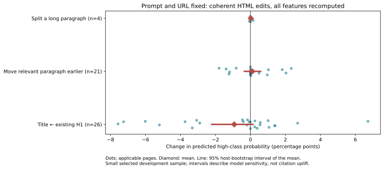
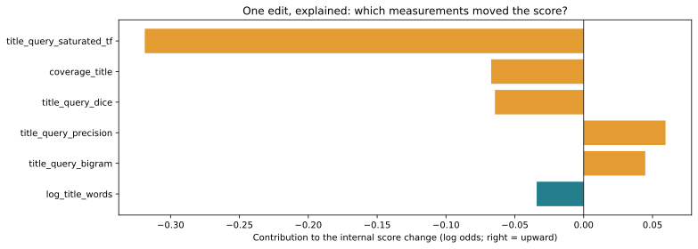
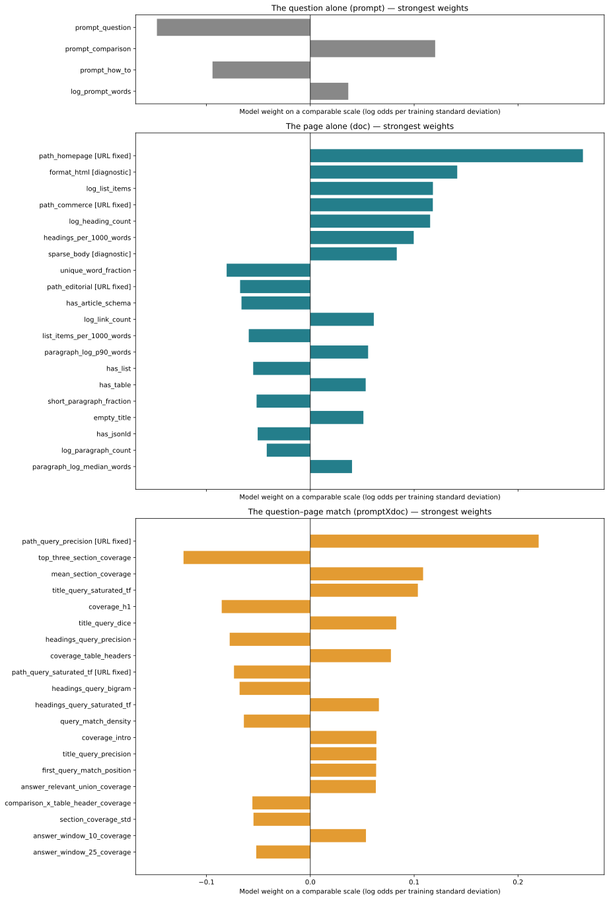
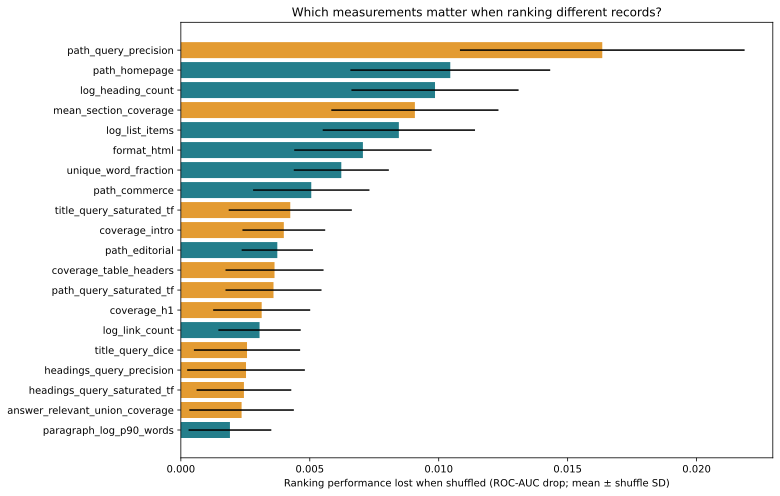

# What happens when we edit a page?

**Keep the reader’s question and the webpage address the same. Make one small change to the page. Does our model’s score move—and what explains the change?**

Imagine editing a school essay while keeping the teacher’s question fixed. We want to know whether a particular revision helps. Looking at what good essays tend to have gives us clues; actually revising an essay and scoring it again answers a more specific question.

That is the purpose of this report. We use our existing **v5 model, which v6 retained**, to try small page edits. We have not retrained it or run another test-set evaluation.

> **What we learned:** These three edits did not show a convincing, consistent benefit in this small sample. Changing the title sometimes helped and sometimes hurt. Moving a relevant paragraph earlier barely moved the average. Splitting a paragraph was tried on too few pages to draw much from it. We have a way to explain the model’s reactions, but no reliable editing recipe yet.

## First, what does “score” mean?

The model estimates whether a page belongs to the **higher-citation group within its website**, using the question and the page. Our dataset compares higher- and lower-performing records that have already been cited. A score of 60% means the model assigns a 60% probability to that higher group in this sampled setting. It does **not** mean a 60% chance that an answer engine will cite the page.

Throughout this report, a change from 60% to 61% is **+1 percentage point**. All before/after changes describe the model’s prediction. To find out whether an edit increases real citations, we would still need to try it and observe answer-engine outcomes.

## 1. Try a real edit, then score the page again

This is what the earlier report called “coherent document edits.” It means **make an actual HTML change and recalculate every page measurement it affects**. Moving a paragraph, for example, can change where relevant text first appears and how sections are grouped. We let those measurements change together.

For each page, we keep its question and address fixed. Different pages can have different questions. We tried three simple edits:

| Edit | What we actually change | Why try it? |
|---|---|---|
| Use the main heading as the title | Copy an existing main heading (H1) into the page’s title. Keep the body wording. | See whether making these two descriptions agree helps the model. The existing heading is not guaranteed to be a better title. |
| Move a relevant paragraph earlier | Move an existing paragraph that matches more question words ahead of an earlier paragraph in the same container. | See whether making relevant information easier to find changes the score. “Relevant” here means word overlap, not verified answer quality. |
| Split a long paragraph | Break one long paragraph into two at an existing sentence boundary. Keep its words and their order. | See whether smaller text blocks change the score. |

We selected **40 validation HTML snapshots** in a fixed order based on their identifiers, without choosing pages because of their labels or potential score gains. An edit only runs when the page has the necessary structure: for example, a page without a suitable long paragraph cannot take the third edit. Those skipped cases are not counted as zero-change results.

### Read this chart like a before-and-after scorecard

- **Each dot is one page** where that edit could be applied. Left of zero means the model’s score went down; right means it went up.
- **The diamond is the average** of those page changes.
- **The horizontal line shows uncertainty around that average**, estimated by repeatedly resampling whole websites. If it crosses zero, the small sample does not give a clear direction for the average response.
- **No line for paragraph splitting:** only four websites contributed. That is too little support for the interval we report for the other edits.



| Edit | Pages where it applied | Websites | Average change | Middle change | Range |
|---|---:|---:|---:|---:|---:|
| Use main heading as title | 26 / 40 | 22 | -0.93 points | -0.03 points | [-7.57, +6.72] points |
| Move relevant paragraph earlier | 21 / 40 | 20 | +0.11 points | +0.00 points | [-1.79, +2.33] points |
| Split a long paragraph | 4 / 40 | 4 | +0.02 points | -0.01 points | [-0.06, +0.15] points |

“Middle change” is the median: half the observed changes lie on either side. “Range” shows the smallest and largest changes we saw; it is not a guarantee for another page.

**What to take away:** Replacing the title with the existing main heading lowered the average score by about **0.93 points**, but individual pages moved in both directions. Moving a matching paragraph earlier increased the average by only **0.11 points**. Splitting a paragraph increased it by **0.02 points**, based on just four pages. The uncertainty lines for the first two edits cross zero. None is an established improvement to apply everywhere.

We checked that every applied edit kept the same body words and word counts. That prevents adding new claims or stuffing in question words, but it does not guarantee good writing: moving a paragraph can still break its context. Simply loading and saving the original HTML changed the score by **0.000000 points**, so these observed changes were not caused by that formatting step alone.

## 2. Follow one edit to see why its score changed

An overall score change is easier to understand when we show the pieces behind it. Here we use the **first applicable edit with a nonzero feature contribution**, rather than picking the biggest improvement.

**Edit:** Use main heading as title.

**Reader’s question:** Best free PDF editor

**Model score: 77.79% → 70.54% (-7.25 percentage points).**

Think of the bars below as entries on a receipt. Each entry explains one part of the model’s reaction to this edit. A bar to the right pushes the internal score up; a bar to the left pushes it down. A bigger bar explains more of the movement. Teal means a page-only measurement; orange means a question–page match. If present, “Other changed features” combines the remaining smaller entries.



The receipt adds up exactly on the model’s internal scale, called **log odds**. That scale is converted to the percentage score afterward, so the bars are **not percentage-point changes**. The question and URL-only measurements contribute zero to this before/after difference because we did not change them.

**How this helps editing:** Look at which measurements actually changed together. A negative bar for a matching feature does not mean we should remove useful text. Several related measurements can share the same information, and the model has learned their weights together.

## 3. Separate the question, the page, and their match

A “feature” is simply a measurement the model uses. We audited which inputs determine every feature. The retained model has **96 raw measurements**:

| Kind | Plain-language meaning | Example | Count |
|---|---|---|---:|
| **prompt** | Something about the reader’s question alone. | Is the question asking how to do something? | 4 |
| **doc** | Something about the page alone, including its address and metadata. | Is it the homepage? How many headings does it have? | 41 |
| **promptXdoc** | Something about how this question and this page fit together. | How many question words appear in the title? | 51 |

Here **X means “uses both inputs.”** It does not mean every feature literally multiplies two numbers.

The distinction matters for editing. `path_homepage` belongs to **doc** because the page address alone determines it. `path_query_precision` belongs to **promptXdoc** because it compares question words with the address. Both stay fixed when we edit only the HTML. Some newer candidates also check whether the page’s body supports that address match; those can change when the body changes.

Likewise, “length of the best-matching section” uses both inputs: the question decides **which section** we measure. By contrast, “fraction of headings written as questions” describes the page alone.

### Chart A: Which measurements have larger model weights?

These panels show the strongest weights in each of the three groups. **Right means a positive weight; left means a negative weight.** Longer bars mean larger weights after accounting for each measurement’s spread in the training data. We show up to 20 per group, not every feature.



`[URL fixed]` marks measurements that cannot move during our HTML-only edits. `[diagnostic]` marks signals about source format or parsing quality; they are context to inspect, not editing goals. Pure-question features still help set the starting score, even though their own contributions do not change when the question stays fixed.

**Read this as a description of the model, not a to-do list.** A large homepage weight, for example, does not tell us to turn every page into a homepage. A weight also cannot tell us what happens when one real edit changes several measurements at once. That is why we start with actual before/after edits.

### Chart B: Which measurements does the model rely on for ranking?

Here we scramble one measurement across validation records and ask: **Does the model become worse at sorting higher- and lower-performing records?** A larger drop means it relied more on that measurement in this check. The ranking measure is ROC-AUC: roughly, how often a randomly chosen higher-group record gets a higher score than a lower-group record.



The short lines show variation across repeated shuffles, not uncertainty about real citation improvement. Measurements that overlap in meaning can cover for each other, making one look less important on its own. Shuffling can also create combinations that would not occur in a real page.

**This chart mixes records with different questions.** Showing only doc and promptXdoc bars does not turn it into a same-question comparison. It tells us about predictive reliance across this dataset, not how much a specific HTML edit would help.

## 4. What evidence is still missing?

Ideally, we would compare many pages answering **the same question on the same website**, with both higher- and lower-performing examples. That would help separate page differences from question differences.

Our validation data has only **1 such group, containing 2 records**. There are 12 repeated question/website groups overall (25 records), but most do not contain both outcomes. Even when we allow different websites, there is only 1 exact-question group with both outcomes. That is too little evidence for a reliable same-question ranking analysis.

The page-edit probes let us inspect the model’s behavior today. They cannot fill that gap in observed outcomes.

## 5. How to make the next report more useful

| Next step | What it would tell us |
|---|---|
| Try a specific, sensible revision; then show every changed measurement and the score difference. | Why the model likes or dislikes that exact edit. Check the text still reads well and remains factual. |
| Show results across more pages, including negative changes and cases where the edit cannot apply. | Whether a result is repeatable or driven by a few examples. Keep uncertainty grouped by website. |
| Collect more pages for the same question and website, with both outcomes. | Which page differences help distinguish higher- from lower-performing examples while the question stays fixed. |
| Test related feature families together. | Whether several overlapping measurements matter collectively, even if one-at-a-time checks look small. |
| Evaluate approved edits against real answer-engine outcomes over time. | Whether model-score changes translate into actual citation improvement, with question, engine and exposure accounted for. |

More explanation tools are not automatically better. **SHAP** assigns credit relative to a reference set of records; **PDP/ALE** summarize score responses as measurements vary. If those references mix unrelated questions or impossible page measurements, their plots can mislead an editor. For this linear model, the exact before/after receipt already explains a concrete edit. If we add other views, their comparisons should respect the fixed question and realistic page changes.

## Technical appendix

The reading above is the main story. The following details make the results reproducible and let you inspect each feature.

### How the exact explanation is calculated

`logit P = intercept + prompt contribution + doc contribution + promptXdoc contribution`

`change in logit = sum of weight × (edited measurement − original measurement)`

Here measurements have already passed through the fitted missing-value handling and training-data scaling. Missingness indicators—extra flags saying a value was absent—are included. The terms sum exactly to the model’s log-odds difference. Probability change is `sigmoid(original logit + change in logit) − sigmoid(original logit)`.

Example record: `000cb33fe83f9e6f903c2221fc7debe9e475ae5fc2baa1a975750b344509ecbe`. Its log-odds change is `-0.38034`. Every changed contribution is stored in the original `interpretation/fixed_prompt/analysis.json`.

Average-effect intervals use 1,000 resamples of website clusters and require at least five websites. These are descriptive 95% bootstrap intervals for the sampled pages and frozen model. They do not include model-training uncertainty or establish causal citation uplift.

### Scope and provenance

This inventory covers **all 142 retention-based v2–v6 candidates**, including rejected candidates: 4 prompt, 41 doc and 97 promptXdoc. The selected model uses 96 of them. Its transformed input has 104 columns after adding missingness indicators; those indicators inherit their underlying feature’s dependency. V1 remains a separate frozen extractor.

The three-way audit supersedes the original companion’s five groups, which mixed input dependency with editing constraints. Original `analysis.json`, `verification.json` and experiment results remain unchanged. All coefficients, shuffle results and edit outcomes in this report reuse that evidence. This rewrite changes presentation only.

### Every feature, with its dependency and editing role

“May vary with HTML” means a suitable edit could change the measurement, not that every edit does. “Selected v5: no” means the candidate is in the audit but is not part of the retained model. Diagnostic flags describe the parser/source; their presence is not a recommendation to optimize them.

| Feature | Dependency | HTML-edit role | Selected v5 | Plain-language definition / rationale | Source |
|---|---|---|---|---|---|
| `log_prompt_words` | prompt | prompt fixed | yes | Computed solely from the user prompt. | retention_features.py |
| `prompt_question` | prompt | prompt fixed | yes | Computed solely from the user prompt. | retention_features.py |
| `prompt_comparison` | prompt | prompt fixed | yes | Computed solely from the user prompt. | retention_features.py |
| `prompt_how_to` | prompt | prompt fixed | yes | Computed solely from the user prompt. | retention_features.py |
| `path_depth` | doc | URL fixed | yes | Computed solely from the document URL. | retention_features.py |
| `path_homepage` | doc | URL fixed | yes | Computed solely from the document URL. | retention_features.py |
| `path_editorial` | doc | URL fixed | yes | Computed solely from the document URL. | retention_features.py |
| `path_commerce` | doc | URL fixed | yes | Computed solely from the document URL. | retention_features.py |
| `path_support_docs` | doc | URL fixed | yes | Computed solely from the document URL. | retention_features.py |
| `coverage_title` | promptXdoc | may vary with HTML | yes | Matches prompt tokens against document text or metadata. | retention_features.py |
| `coverage_headings` | promptXdoc | may vary with HTML | yes | Matches prompt tokens against document text or metadata. | retention_features.py |
| `coverage_body` | promptXdoc | may vary with HTML | yes | Matches prompt tokens against document text or metadata. | retention_features.py |
| `coverage_intro` | promptXdoc | may vary with HTML | yes | Matches prompt tokens against document text or metadata. | retention_features.py |
| `log_word_count` | doc | may vary with HTML | yes | Counts retained document content, without reading the prompt. | retention_features.py |
| `log_title_words` | doc | may vary with HTML | yes | Counts retained document content, without reading the prompt. | retention_features.py |
| `log_heading_count` | doc | may vary with HTML | yes | Counts retained document content, without reading the prompt. | retention_features.py |
| `log_h1_count` | doc | may vary with HTML | yes | Counts retained document content, without reading the prompt. | retention_features.py |
| `log_list_items` | doc | may vary with HTML | yes | Counts retained document content, without reading the prompt. | retention_features.py |
| `log_table_count` | doc | may vary with HTML | yes | Counts retained document content, without reading the prompt. | retention_features.py |
| `log_paragraph_count` | doc | may vary with HTML | yes | Counts retained document content, without reading the prompt. | retention_features.py |
| `log_code_count` | doc | may vary with HTML | yes | Counts retained document content, without reading the prompt. | retention_features.py |
| `log_ordered_steps` | doc | may vary with HTML | yes | Counts retained document content, without reading the prompt. | retention_features.py |
| `headings_per_1000_words` | doc | may vary with HTML | yes | Measures document structure, without reading the prompt. | retention_features.py |
| `list_items_per_1000_words` | doc | may vary with HTML | yes | Measures document structure, without reading the prompt. | retention_features.py |
| `has_table` | doc | may vary with HTML | yes | Measures document structure, without reading the prompt. | retention_features.py |
| `has_list` | doc | may vary with HTML | yes | Measures document structure, without reading the prompt. | retention_features.py |
| `has_jsonld` | doc | may vary with HTML | yes | Reads document source metadata, without reading the prompt. | retention_features.py |
| `has_article_schema` | doc | may vary with HTML | yes | Reads document source metadata, without reading the prompt. | retention_features.py |
| `log_source_script_count` | doc | diagnostic; not an edit target | yes | Reads document source metadata, without reading the prompt. | retention_features.py |
| `empty_title` | doc | may vary with HTML | yes | Reads document source metadata, without reading the prompt. | retention_features.py |
| `retained_text_fraction` | doc | diagnostic; not an edit target | yes | Describes source format or parser retention/quality, without reading the prompt. | retention_features.py |
| `needs_review` | doc | diagnostic; not an edit target | yes | Describes source format or parser retention/quality, without reading the prompt. | retention_features.py |
| `possible_error_response` | doc | diagnostic; not an edit target | yes | Describes source format or parser retention/quality, without reading the prompt. | retention_features.py |
| `sparse_body` | doc | diagnostic; not an edit target | yes | Describes source format or parser retention/quality, without reading the prompt. | retention_features.py |
| `format_html` | doc | diagnostic; not an edit target | yes | Describes source format or parser retention/quality, without reading the prompt. | retention_features.py |
| `coverage_h1` | promptXdoc | may vary with HTML | yes | Uses prompt matching, query-selected sections, or prompt intent × document structure. | retention_features.py |
| `coverage_table_headers` | promptXdoc | may vary with HTML | yes | Uses prompt matching, query-selected sections, or prompt intent × document structure. | retention_features.py |
| `best_section_coverage` | promptXdoc | may vary with HTML | yes | Uses prompt matching, query-selected sections, or prompt intent × document structure. | retention_features.py |
| `mean_section_coverage` | promptXdoc | may vary with HTML | yes | Uses prompt matching, query-selected sections, or prompt intent × document structure. | retention_features.py |
| `matching_section_fraction` | promptXdoc | may vary with HTML | yes | Uses prompt matching, query-selected sections, or prompt intent × document structure. | retention_features.py |
| `best_section_heading_coverage` | promptXdoc | may vary with HTML | yes | Uses prompt matching, query-selected sections, or prompt intent × document structure. | retention_features.py |
| `best_section_position` | promptXdoc | may vary with HTML | yes | Uses prompt matching, query-selected sections, or prompt intent × document structure. | retention_features.py |
| `comparison_x_table_header_coverage` | promptXdoc | may vary with HTML | yes | Uses prompt matching, query-selected sections, or prompt intent × document structure. | retention_features.py |
| `how_to_x_ordered_steps` | promptXdoc | may vary with HTML | yes | Uses prompt matching, query-selected sections, or prompt intent × document structure. | retention_features.py |
| `body_query_precision` | promptXdoc | may vary with HTML | yes | How much of the distinct body vocabulary belongs to the question? | frontier_features.py |
| `body_query_dice` | promptXdoc | may vary with HTML | yes | How similar are the question and body word sets, accounting for both lengths? | frontier_features.py |
| `body_query_saturated_tf` | promptXdoc | may vary with HTML | yes | How often do question words appear in body, with diminishing credit for repeats? | frontier_features.py |
| `body_query_bigram` | promptXdoc | may vary with HTML | yes | What fraction of adjacent question-word pairs appear together in body? | frontier_features.py |
| `title_query_precision` | promptXdoc | may vary with HTML | yes | How much of the distinct title vocabulary belongs to the question? | frontier_features.py |
| `title_query_dice` | promptXdoc | may vary with HTML | yes | How similar are the question and title word sets, accounting for both lengths? | frontier_features.py |
| `title_query_saturated_tf` | promptXdoc | may vary with HTML | yes | How often do question words appear in title, with diminishing credit for repeats? | frontier_features.py |
| `title_query_bigram` | promptXdoc | may vary with HTML | yes | What fraction of adjacent question-word pairs appear together in title? | frontier_features.py |
| `description_query_precision` | promptXdoc | may vary with HTML | yes | How much of the distinct description vocabulary belongs to the question? | frontier_features.py |
| `description_query_dice` | promptXdoc | may vary with HTML | yes | How similar are the question and description word sets, accounting for both lengths? | frontier_features.py |
| `description_query_saturated_tf` | promptXdoc | may vary with HTML | yes | How often do question words appear in description, with diminishing credit for repeats? | frontier_features.py |
| `description_query_bigram` | promptXdoc | may vary with HTML | yes | What fraction of adjacent question-word pairs appear together in description? | frontier_features.py |
| `path_query_precision` | promptXdoc | URL fixed | yes | How much of the distinct path vocabulary belongs to the question? | frontier_features.py |
| `path_query_dice` | promptXdoc | URL fixed | yes | How similar are the question and path word sets, accounting for both lengths? | frontier_features.py |
| `path_query_saturated_tf` | promptXdoc | URL fixed | yes | How often do question words appear in path, with diminishing credit for repeats? | frontier_features.py |
| `path_query_bigram` | promptXdoc | URL fixed | yes | What fraction of adjacent question-word pairs appear together in path? | frontier_features.py |
| `headings_query_precision` | promptXdoc | may vary with HTML | yes | How much of the distinct headings vocabulary belongs to the question? | frontier_features.py |
| `headings_query_dice` | promptXdoc | may vary with HTML | yes | How similar are the question and headings word sets, accounting for both lengths? | frontier_features.py |
| `headings_query_saturated_tf` | promptXdoc | may vary with HTML | yes | How often do question words appear in headings, with diminishing credit for repeats? | frontier_features.py |
| `headings_query_bigram` | promptXdoc | may vary with HTML | yes | What fraction of adjacent question-word pairs appear together in headings? | frontier_features.py |
| `section_coverage_fraction_0_5` | promptXdoc | may vary with HTML | yes | What fraction of sections cover at least 50% of question words? | frontier_features.py |
| `section_coverage_fraction_0_8` | promptXdoc | may vary with HTML | yes | What fraction of sections cover at least 80% of question words? | frontier_features.py |
| `section_coverage_fraction_1_0` | promptXdoc | may vary with HTML | yes | What fraction of sections cover at least 100% of question words? | frontier_features.py |
| `section_coverage_std` | promptXdoc | may vary with HTML | yes | Is question coverage spread evenly across sections or concentrated in a few? | frontier_features.py |
| `top_three_section_coverage` | promptXdoc | may vary with HTML | yes | How well do the three best sections cover the question? | frontier_features.py |
| `best_section_log_words` | promptXdoc | may vary with HTML | yes | How long is the section that best matches the question? The section is selected by prompt coverage. | frontier_features.py |
| `first_query_match_position` | promptXdoc | may vary with HTML | yes | How far into the page is the first question word? | frontier_features.py |
| `query_match_density` | promptXdoc | may vary with HTML | yes | What fraction of page words match the question? | frontier_features.py |
| `paragraph_log_median_words` | doc | may vary with HTML | yes | How long is a typical paragraph? | frontier_features.py |
| `paragraph_log_p90_words` | doc | may vary with HTML | yes | How long are the longer paragraphs? | frontier_features.py |
| `short_paragraph_fraction` | doc | may vary with HTML | yes | How many paragraphs are short, readable chunks of 10 to 60 words? | frontier_features.py |
| `unique_word_fraction` | doc | may vary with HTML | yes | How much vocabulary variety does the page have? This also depends on length. | frontier_features.py |
| `numeric_word_fraction` | doc | may vary with HTML | yes | How often does the page include numbers? | frontier_features.py |
| `question_heading_fraction` | doc | may vary with HTML | yes | How many headings are written as questions? | frontier_features.py |
| `duplicate_heading_fraction` | doc | may vary with HTML | yes | How often are headings repeated? | frontier_features.py |
| `log_link_count` | doc | may vary with HTML | yes | How many links appear in retained blocks? | frontier_features.py |
| `links_per_1000_words` | doc | may vary with HTML | yes | How link-heavy is the page relative to its length? | frontier_features.py |
| `heading_word_fraction` | doc | may vary with HTML | yes | How much retained text is inside heading blocks? | frontier_features.py |
| `paragraph_word_fraction` | doc | may vary with HTML | yes | How much retained text is inside paragraph blocks? | frontier_features.py |
| `list_item_word_fraction` | doc | may vary with HTML | yes | How much retained text is inside list item blocks? | frontier_features.py |
| `table_word_fraction` | doc | may vary with HTML | yes | How much retained text is inside table blocks? | frontier_features.py |
| `code_word_fraction` | doc | may vary with HTML | yes | How much retained text is inside code blocks? | frontier_features.py |
| `answer_best_sentence_coverage` | promptXdoc | may vary with HTML | yes | How much of the question appears together in one 6–80-word sentence? | evidence_features.py |
| `answer_top3_sentence_coverage` | promptXdoc | may vary with HTML | yes | How much question coverage do the three best distinct sentences provide? | evidence_features.py |
| `answer_relevant_sentence_fraction` | promptXdoc | may vary with HTML | yes | What fraction of distinct sentences cover at least half the meaningful question words? | evidence_features.py |
| `answer_log_relevant_sentences` | promptXdoc | may vary with HTML | yes | How many distinct question-relevant sentences are available? Large counts are squeezed. | evidence_features.py |
| `answer_best_sentence_precision` | promptXdoc | may vary with HTML | yes | How focused is the most question-dense sentence? | evidence_features.py |
| `answer_relevant_median_words` | promptXdoc | may vary with HTML | yes | How long is a typical relevant sentence? | evidence_features.py |
| `answer_window_10_coverage` | promptXdoc | may vary with HTML | yes | How much of the question occurs within a 10-word prose window? | evidence_features.py |
| `answer_window_25_coverage` | promptXdoc | may vary with HTML | yes | How much of the question occurs within a 25-word prose window? | evidence_features.py |
| `answer_window_50_coverage` | promptXdoc | may vary with HTML | yes | How much of the question occurs within a 50-word prose window? | evidence_features.py |
| `answer_relevant_union_coverage` | promptXdoc | may vary with HTML | yes | Together, how much of the question do relevant distinct sentences cover? | evidence_features.py |
| `evidence_number_fraction` | promptXdoc | may vary with HTML | no | What fraction of relevant sentences contain a number cue? This does not verify truth. Relevant sentences are selected using the prompt, so this is a joint feature. | evidence_features.py |
| `evidence_number_coverage` | promptXdoc | may vary with HTML | no | How well does the best relevant sentence with a number cue cover the question? Relevant sentences are selected using the prompt, so this is a joint feature. | evidence_features.py |
| `evidence_unit_fraction` | promptXdoc | may vary with HTML | no | What fraction of relevant sentences contain a unit cue? This does not verify truth. Relevant sentences are selected using the prompt, so this is a joint feature. | evidence_features.py |
| `evidence_unit_coverage` | promptXdoc | may vary with HTML | no | How well does the best relevant sentence with a unit cue cover the question? Relevant sentences are selected using the prompt, so this is a joint feature. | evidence_features.py |
| `evidence_definition_fraction` | promptXdoc | may vary with HTML | no | What fraction of relevant sentences contain a definition cue? This does not verify truth. Relevant sentences are selected using the prompt, so this is a joint feature. | evidence_features.py |
| `evidence_definition_coverage` | promptXdoc | may vary with HTML | no | How well does the best relevant sentence with a definition cue cover the question? Relevant sentences are selected using the prompt, so this is a joint feature. | evidence_features.py |
| `evidence_linked_fraction` | promptXdoc | may vary with HTML | no | How often are relevant sentences inside a block with a link? A link need not be a trustworthy citation. Relevant sentences are selected using the prompt, so this is a joint feature. | evidence_features.py |
| `evidence_numeric_intent_alignment` | promptXdoc | may vary with HTML | no | For a numeric question, does a relevant sentence contain a number? Relevant sentences are selected using the prompt, so this is a joint feature. | evidence_features.py |
| `evidence_definition_intent_alignment` | promptXdoc | may vary with HTML | no | For a definition or explanation question, does relevant prose use an explanation cue? Relevant sentences are selected using the prompt, so this is a joint feature. | evidence_features.py |
| `table_best_value_row_coverage` | promptXdoc | may vary with HTML | no | How well does one table data row cover the question, excluding header cells? | evidence_features.py |
| `table_top3_value_row_coverage` | promptXdoc | may vary with HTML | no | How well do the three best distinct table data rows match? | evidence_features.py |
| `table_relevant_row_fraction` | promptXdoc | may vary with HTML | no | What fraction of distinct table data rows cover half the question? | evidence_features.py |
| `table_numeric_row_coverage` | promptXdoc | may vary with HTML | no | How well does a table data row containing numbers match the question? | evidence_features.py |
| `table_header_best_coverage` | promptXdoc | may vary with HTML | no | What is the best question match within the headers of one table? | evidence_features.py |
| `table_numeric_intent_alignment` | promptXdoc | may vary with HTML | no | For numeric questions, how relevant is the best numeric table row? | evidence_features.py |
| `steps_best_coverage` | promptXdoc | may vary with HTML | no | How well does one distinct numbered step match the question? | evidence_features.py |
| `steps_relevant_fraction` | promptXdoc | may vary with HTML | no | What fraction of distinct numbered steps cover half the question? | evidence_features.py |
| `steps_howto_alignment` | promptXdoc | may vary with HTML | no | For how-to questions, is there a matching numbered step? | evidence_features.py |
| `supported_coverage_title` | promptXdoc | may vary with HTML | no | coverage_title multiplied by best answer-sentence coverage: metadata gets lexical credit only when prose also matches. Body support may change even when the URL stays fixed. | control_features.py |
| `supported_title_query_precision` | promptXdoc | may vary with HTML | no | title_query_precision multiplied by best answer-sentence coverage: metadata gets lexical credit only when prose also matches. Body support may change even when the URL stays fixed. | control_features.py |
| `supported_title_query_dice` | promptXdoc | may vary with HTML | no | title_query_dice multiplied by best answer-sentence coverage: metadata gets lexical credit only when prose also matches. Body support may change even when the URL stays fixed. | control_features.py |
| `supported_title_query_saturated_tf` | promptXdoc | may vary with HTML | no | title_query_saturated_tf multiplied by best answer-sentence coverage: metadata gets lexical credit only when prose also matches. Body support may change even when the URL stays fixed. | control_features.py |
| `supported_title_query_bigram` | promptXdoc | may vary with HTML | no | title_query_bigram multiplied by best answer-sentence coverage: metadata gets lexical credit only when prose also matches. Body support may change even when the URL stays fixed. | control_features.py |
| `supported_path_query_precision` | promptXdoc | may vary with HTML | no | path_query_precision multiplied by best answer-sentence coverage: metadata gets lexical credit only when prose also matches. Body support may change even when the URL stays fixed. | control_features.py |
| `supported_path_query_dice` | promptXdoc | may vary with HTML | no | path_query_dice multiplied by best answer-sentence coverage: metadata gets lexical credit only when prose also matches. Body support may change even when the URL stays fixed. | control_features.py |
| `supported_path_query_saturated_tf` | promptXdoc | may vary with HTML | no | path_query_saturated_tf multiplied by best answer-sentence coverage: metadata gets lexical credit only when prose also matches. Body support may change even when the URL stays fixed. | control_features.py |
| `supported_path_query_bigram` | promptXdoc | may vary with HTML | no | path_query_bigram multiplied by best answer-sentence coverage: metadata gets lexical credit only when prose also matches. Body support may change even when the URL stays fixed. | control_features.py |
| `long_window_10_best` | promptXdoc | may vary with HTML | no | Best question coverage inside a 10-word window in prose segments longer than 80 tokens. | control_features.py |
| `long_window_10_mean` | promptXdoc | may vary with HTML | no | Average best 10-word question coverage across distinct long prose segments; exact repetition receives no extra count. | control_features.py |
| `long_window_25_best` | promptXdoc | may vary with HTML | no | Best question coverage inside a 25-word window in prose segments longer than 80 tokens. | control_features.py |
| `long_window_25_mean` | promptXdoc | may vary with HTML | no | Average best 25-word question coverage across distinct long prose segments; exact repetition receives no extra count. | control_features.py |
| `long_window_50_best` | promptXdoc | may vary with HTML | no | Best question coverage inside a 50-word window in prose segments longer than 80 tokens. | control_features.py |
| `long_window_50_mean` | promptXdoc | may vary with HTML | no | Average best 50-word question coverage across distinct long prose segments; exact repetition receives no extra count. | control_features.py |
| `normalized_title_coverage` | promptXdoc | may vary with HTML | no | Question-word coverage in title after fixed plural, spelling, unit and number normalization. | control_features.py |
| `normalized_title_gain` | promptXdoc | may vary with HTML | no | Change in title coverage from lexical normalization; may be negative when normalization changes token sets. | control_features.py |
| `normalized_path_coverage` | promptXdoc | URL fixed | no | Question-word coverage in path after fixed plural, spelling, unit and number normalization. | control_features.py |
| `normalized_path_gain` | promptXdoc | URL fixed | no | Change in path coverage from lexical normalization; may be negative when normalization changes token sets. | control_features.py |
| `normalized_body_coverage` | promptXdoc | may vary with HTML | no | Question-word coverage in body after fixed plural, spelling, unit and number normalization. | control_features.py |
| `normalized_body_gain` | promptXdoc | may vary with HTML | no | Change in body coverage from lexical normalization; may be negative when normalization changes token sets. | control_features.py |
| `normalized_prose_window_10` | promptXdoc | may vary with HTML | no | Best 10-word prose coverage after normalization, using the same 6–80-token sentence eligibility as v5. | control_features.py |
| `normalized_prose_window_25` | promptXdoc | may vary with HTML | no | Best 25-word prose coverage after normalization, using the same 6–80-token sentence eligibility as v5. | control_features.py |
| `normalized_number_coverage` | promptXdoc | may vary with HTML | no | Do the explicit numbers in the question appear in the body after numeric-format normalization? Units are not converted. | control_features.py |
| `supported_normalized_title_coverage` | promptXdoc | may vary with HTML | no | normalized_title_coverage multiplied by prose support, keeping combined metadata corroboration intact. Body support may change even when the URL stays fixed. | control_features.py |
| `supported_normalized_title_gain` | promptXdoc | may vary with HTML | no | normalized_title_gain multiplied by prose support, keeping combined metadata corroboration intact. Body support may change even when the URL stays fixed. | control_features.py |
| `supported_normalized_path_coverage` | promptXdoc | may vary with HTML | no | normalized_path_coverage multiplied by prose support, keeping combined metadata corroboration intact. Body support may change even when the URL stays fixed. | control_features.py |
| `supported_normalized_path_gain` | promptXdoc | may vary with HTML | no | normalized_path_gain multiplied by prose support, keeping combined metadata corroboration intact. Body support may change even when the URL stays fixed. | control_features.py |

### Rebuild the report

From the repository root:

```sh
uv run python -m trad_ml_scorer.build_fixed_prompt_report
```

This rebuilds Markdown, standalone HTML and plots from the saved analysis. It does not redo data preparation, fit a model, or evaluate the test set. All images are embedded in the HTML.

The original edit-analysis command is `uv run python -m trad_ml_scorer.analyze_fixed_prompt --input-dir data/raw`. It reads local snapshots and refuses to overwrite existing results. It is not needed for this presentation update.
