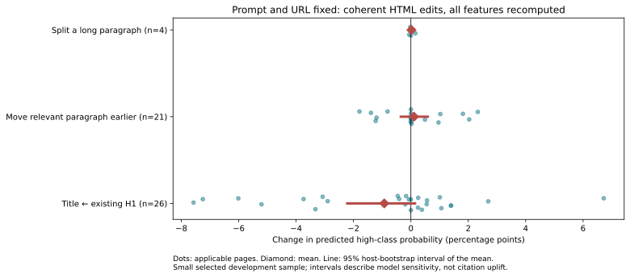
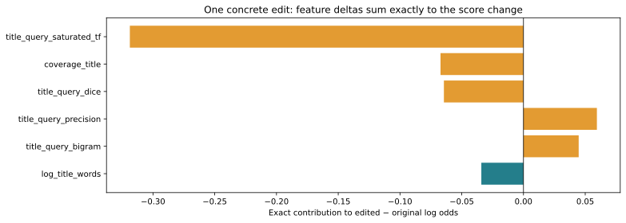
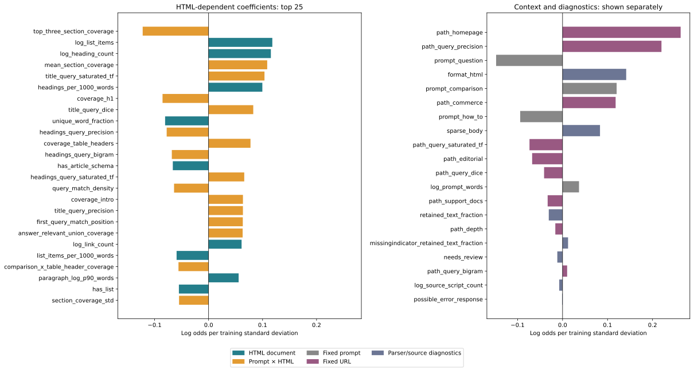
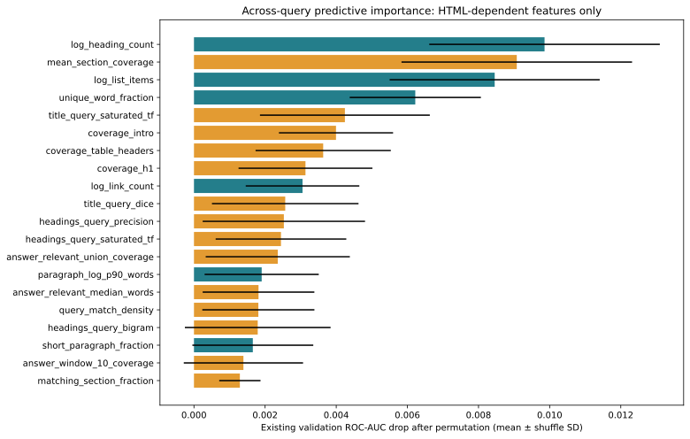

# Feature importance for fixed-prompt HTML editing

**Model:** frozen v5, retained by v6. No refit, feature selection or test-set evaluation. This companion reinterprets the model; original experiment reports remain frozen.

## The right quantity is the change for the same prompt

For a fixed query and URL, prompt-only terms act as a query-specific intercept. They cancel in a before/after **log-odds** comparison. Keep them in the model: they still set the baseline probability and therefore the probability response to an edit. Prompt–document interactions remain variable and belong in the editing analysis.

`logit P = intercept + prompt contribution + URL contribution + HTML contribution + prompt×HTML contribution + diagnostic contribution`

`Δlogit = Σ β_j [z_j(edited HTML, fixed prompt) − z_j(original HTML, fixed prompt)]`

Here `z` includes the fitted imputer, missing indicators and training scaler. Pure prompt and URL terms have exactly zero delta. Probability change is `sigmoid(original logit + Δlogit) − sigmoid(original logit)`; feature contributions are additive in log odds, not probability points.

The modeled probability is the sampled within-host high class **among already-cited pages**, not the probability of being cited at all.

## 1. Primary view: coherent document edits

We use the first 40 hash-sorted validation HTML snapshots, selected without label or score-gain filtering. The same prompt and URL are supplied before and after every edit; the aggregate combines different fixed-query pairs, not one shared query. All features are recomputed from the edited HTML. Every applicable edit preserves the visible body word multiset; edits insert no new factual assertions or query stuffing. This does not guarantee unchanged semantics or better editorial quality—moving a paragraph can disrupt context, and the existing H1 may make a poor title.



| Edit | Applicable / sampled | Hosts | Mean Δ probability | Median Δ probability | Observed range |
|---|---:|---:|---:|---:|---:|
| Title ← existing H1 | 26 / 40 | 22 | -0.93 pp | -0.03 pp | [-7.57, +6.72] pp |
| Move relevant paragraph earlier | 21 / 40 | 20 | +0.11 pp | +0.00 pp | [-1.79, +2.33] pp |
| Split a long paragraph | 4 / 40 | 4 | +0.02 pp | -0.01 pp | [-0.06, +0.15] pp |

Non-applicable edits are recorded, not counted as zero effects. Confidence intervals resample host clusters (1,000 replicates) when at least five hosts are available; they are descriptive for this small development sample and frozen model. Maximum absolute serialization-only probability change was **0.000000 pp**; each record also stores edit-versus-serialization change.

## 2. Exact explanation of one edit

First applicable edit with a changed model contribution: **Title ← existing H1**. This example was not chosen for maximum gain.

Prompt: Best free PDF editor

Record: `000cb33fe83f9e6f903c2221fc7debe9e475ae5fc2baa1a975750b344509ecbe`. Predicted score: **0.7779 → 0.7054**; Δlogit **-0.38034**.



All changed transformed-feature contributions, including missingness effects, are stored in analysis.json and verified to sum to the model logit difference. Fixed prompt and URL contributions are checked to be zero for every edit.

## 3. Replotted global importance, with context separated

The left coefficient panel includes HTML-only and prompt–HTML features; the right panel explicitly separates prompt, URL and source/parser signals. URL matching is not an HTML editing lever when the page URL is fixed. Parser flags and source-format signals are diagnostics rather than optimization targets.





**This permutation plot is still across-query predictive importance**, copied from the original validation audit and filtered by dependency. Hiding prompt-only bars does not make it conditional importance, and it does not estimate an edit’s effect. A standardized coefficient describes a fitted slope; a permutation drop describes predictive reliance. Neither is a causal citation recommendation. A negative coefficient on a coverage feature can arise while related coverage inputs carry positive coefficients; it is not a recommendation to remove relevant text. Recompute the full feature vector for a coherent edit instead.

## 4. Why we do not claim reliable within-query ranking importance

Validation has only **1 same-prompt/same-host group with both labels (2 rows)**. It has 12 repeated groups total (25 rows). Exact-query groups across hosts contain only 1 mixed-label group too. A within-query ranking AUC or label-based conditional permutation estimate would be far too fragile here. We report the support count instead of a misleading near-zero importance estimate.

## Better computation and interpretation going forward

| Question | Preferred computation / plot | Interpretation and limits |
|---|---|---|
| What can change this page’s score for this query? | Real HTML edit → reparse → recompute all features; paired Δprobability with exact Δlogit attribution. | Best editing-oriented view. Keep query, URL and factual content fixed; inspect interactions and all side effects. Score increase is not demonstrated citation uplift. |
| Which signals distinguish documents for the same query? | Within-query (preferably within-host) ranking metrics and grouped conditional permutation on a substantially larger matched dataset. | Keep pure-query features constant. Report effective groups/rows; avoid estimates driven by one pair. |
| Which correlated feature families matter? | Joint family permutation on appropriately matched donors, or predeclared family ablation refits. | Shuffling one correlated feature may understate reliance; unrelated donors can create impossible feature combinations. Fit/refit only development data. |
| Is an effect stable across pages? | Paired edit distributions, applicability counts, host-bootstrap intervals and per-query slices. | Do not show only mean gain or cherry-pick winners. Include negative edits, failed cases, serialization controls and manipulation probes. |
| Should we use SHAP, PDP or ALE? | For LR edits, exact paired logit contributions already solve the attribution problem. If adding SHAP, use a query-conditioned background and correlated groups; use feasible fixed-query ICE/ALE ranges only. | Generic backgrounds can assign query/context effects to apparent editing levers. One-feature interventions can violate feature dependencies. None supplies causal evidence. |
| Will an edit increase real citations? | Grounded editorial checks followed by prospective same-query evaluation with engine/time/exposure controls. | Existing observational relative labels and score gradients cannot establish this. Retain factuality and adversarial checks before optimization. |

## Feature dependency inventory

| Group | Raw feature count | Features |
|---|---:|---|
| HTML document | 30 | log_word_count, log_title_words, log_heading_count, log_h1_count, log_list_items, log_table_count, log_paragraph_count, log_code_count, log_ordered_steps, headings_per_1000_words, list_items_per_1000_words, has_table, has_list, has_jsonld, has_article_schema, empty_title, paragraph_log_median_words, paragraph_log_p90_words, short_paragraph_fraction, unique_word_fraction, numeric_word_fraction, question_heading_fraction, duplicate_heading_fraction, log_link_count, links_per_1000_words, heading_word_fraction, paragraph_word_fraction, list_item_word_fraction, table_word_fraction, code_word_fraction |
| Prompt × HTML | 47 | coverage_title, coverage_headings, coverage_body, coverage_intro, coverage_h1, coverage_table_headers, best_section_coverage, mean_section_coverage, matching_section_fraction, best_section_heading_coverage, best_section_position, comparison_x_table_header_coverage, how_to_x_ordered_steps, body_query_precision, body_query_dice, body_query_saturated_tf, body_query_bigram, title_query_precision, title_query_dice, title_query_saturated_tf, title_query_bigram, description_query_precision, description_query_dice, description_query_saturated_tf, description_query_bigram, headings_query_precision, headings_query_dice, headings_query_saturated_tf, headings_query_bigram, section_coverage_fraction_0_5, section_coverage_fraction_0_8, section_coverage_fraction_1_0, section_coverage_std, top_three_section_coverage, best_section_log_words, first_query_match_position, query_match_density, answer_best_sentence_coverage, answer_top3_sentence_coverage, answer_relevant_sentence_fraction, answer_log_relevant_sentences, answer_best_sentence_precision, answer_relevant_median_words, answer_window_10_coverage, answer_window_25_coverage, answer_window_50_coverage, answer_relevant_union_coverage |
| Fixed prompt | 4 | log_prompt_words, prompt_question, prompt_comparison, prompt_how_to |
| Fixed URL | 9 | path_depth, path_homepage, path_editorial, path_commerce, path_support_docs, path_query_precision, path_query_dice, path_query_saturated_tf, path_query_bigram |
| Parser/source diagnostics | 6 | log_source_script_count, retained_text_fraction, needs_review, possible_error_response, sparse_body, format_html |

## Reproduction

```sh
uv run python -m trad_ml_scorer.analyze_fixed_prompt --input-dir data/raw
uv run python -m trad_ml_scorer.build_fixed_prompt_report
```

The analysis command refuses to overwrite frozen results. The plotting command can regenerate visuals from analysis.json. Input snapshots are read locally; no pages are fetched, no embeddings are generated, and no model/default is changed.
