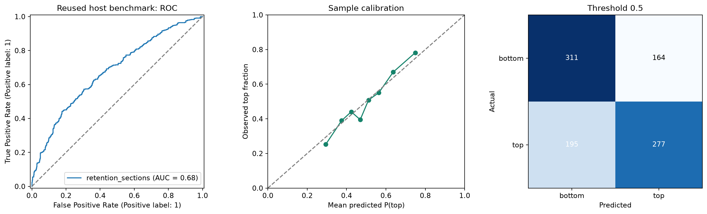
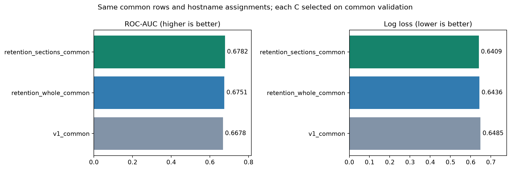
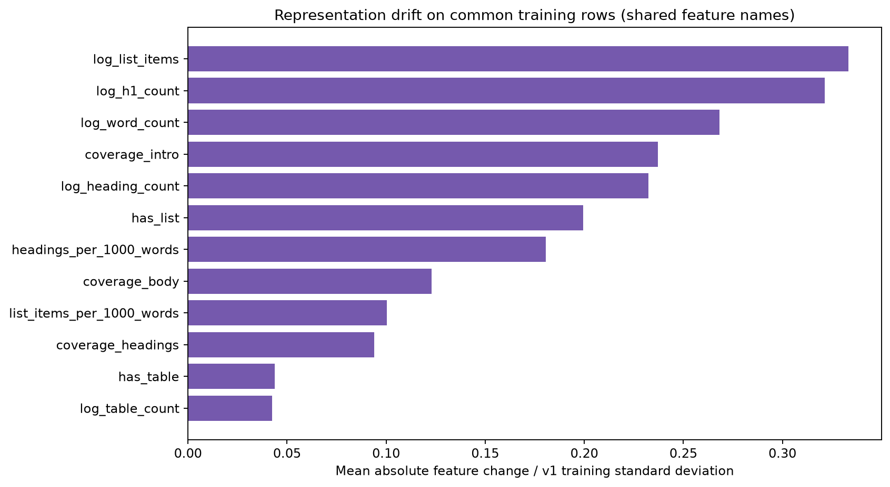
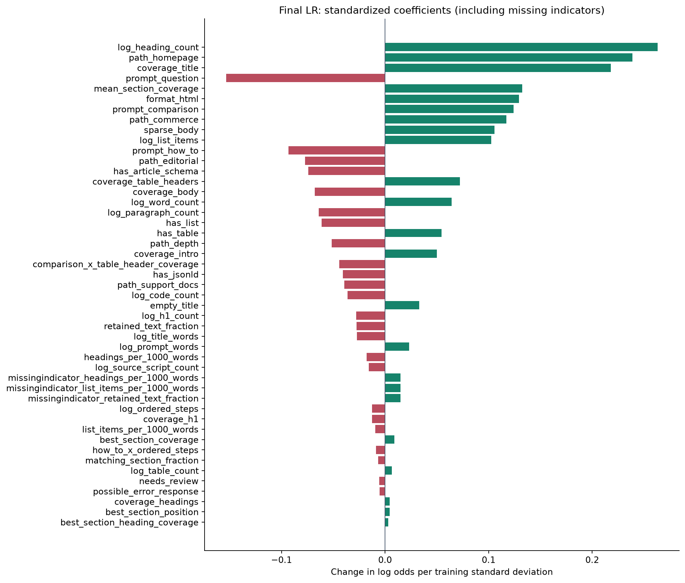
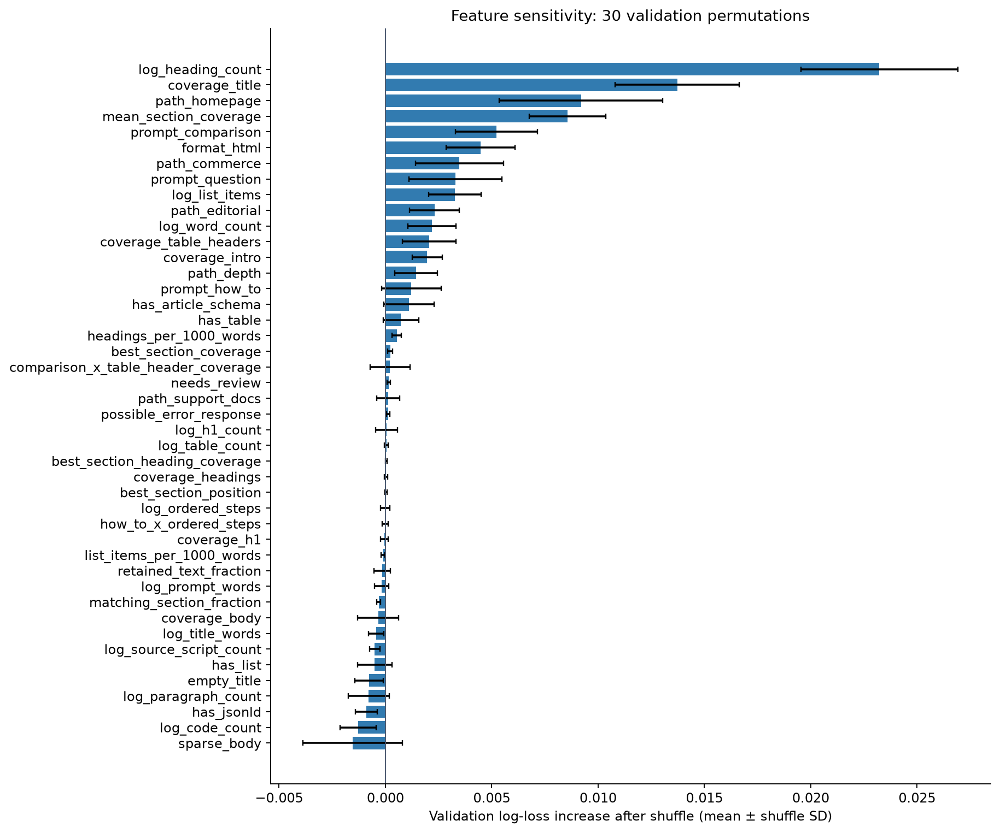
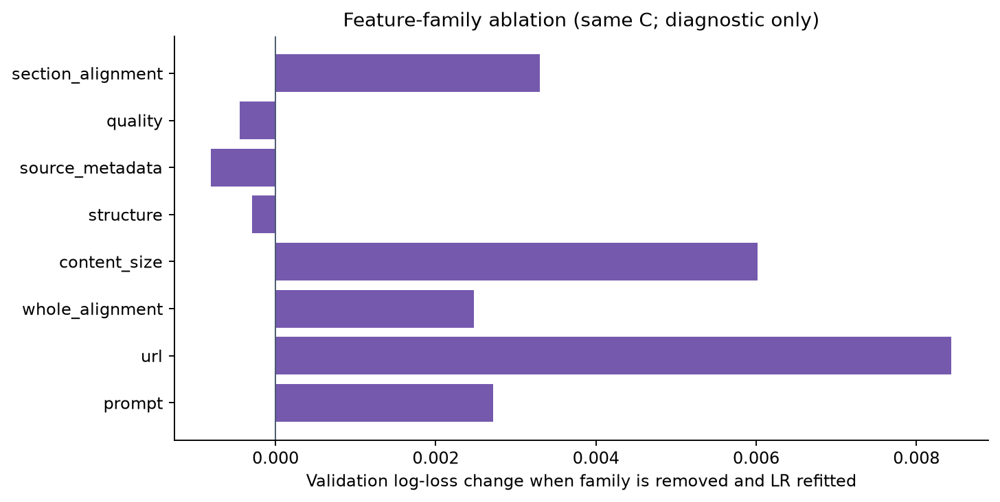
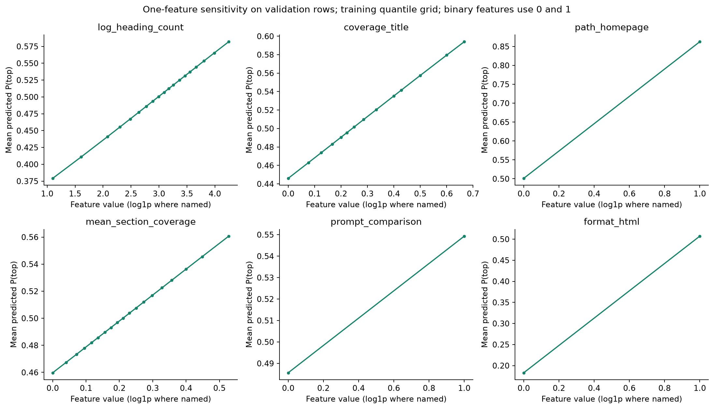

# Retention-first LR v2

Selected by validation log loss: retention_sections, C=0.01; 44 fitted raw features. The model is fit on train only.

Reused host-benchmark ROC-AUC: 0.6769 (95% host-bootstrap interval 0.6395–0.7112); 947 rows across 97 hosts. This is not a fresh independent test.

## Source of truth and corpus coverage

All page content, structure, and source metadata now come from the preprocessing retention-first contract: source_inventory → conservative_dom for HTML or markdown_text for native formats → retention-first selection → downstream document. No v1 extraction fallback is used. Shared v1 helpers supply only tokenization, lexical coverage, and fixed URL regexes.

Processed 9551 exact snapshots for all 9700 input records. Each compressed document retains blocks, outline, chunks, metadata, quality status, and a source Parquet-row reference with payload/file hashes. Snapshot identity includes both exact payload and exact URL; prompt and label are joined afterward.

No input records were lost: 111 snapshots are referenced by 260 records, giving 149 extra references to shared documents. All 9700 records have an archived snapshot. This deduplicates parsing work, not prompt/label rows, and is unrelated to splitting. Modeling exclusions are accounted for separately below.

Snapshot statuses: {"selected": 9168, "needs_review": 333, "source_insufficient": 47, "unsupported_format": 3}. Unsupported, failed, or contentless snapshots are recorded and excluded rather than silently replaced. Selected content marked needs_review remains scoreable with its warning.

## Frozen split and eligibility

| Split | v2 rows | Hosts | Common v1/v2 rows |
| --- | ---: | ---: | ---: |
| train | 7540 | 771 | 7525 |
| validation | 945 | 97 | 945 |
| test | 947 | 97 | 938 |

Eligible population: 9432 v2 rows; 9408 in common with v1; 39 v1-only and 24 v2-only. Exclusion counts overlap: {"blank_prompt": 91, "no_selected_retained_content": 54, "conflicting_url_labels": 76, "html_shared_across_hosts": 25, "exact_duplicate": 28, "retained_text_shared_across_hosts": 22}.

Host assignments are copied from v1, never reshuffled. Hostname, URL, exact HTML, nonempty normalized retained-text, and record overlaps across splits are zero. Repeated prompts across hosts are permitted for this unseen-host scenario.

## Reused-benchmark results

| Variant | Population | Rows | ROC-AUC | Log loss | Brier | Accuracy | Within-host AUC |
| --- | --- | ---: | ---: | ---: | ---: | ---: | ---: |
| retention_whole | v2 eligible | 947 | 0.6740 | 0.6441 | 0.2267 | 0.6272 | 0.6859 |
| retention_sections | v2 eligible | 947 | 0.6769 | 0.6415 | 0.2256 | 0.6209 | 0.6859 |
| v1_common | common | 938 | 0.6678 | 0.6485 | 0.2287 | 0.6151 | 0.6788 |
| retention_whole_common | common | 938 | 0.6751 | 0.6436 | 0.2265 | 0.6269 | 0.6890 |
| retention_sections_common | common | 938 | 0.6782 | 0.6409 | 0.2253 | 0.6173 | 0.6905 |

Selected model on the v2 clean subset: n=917, ROC-AUC=0.6765, log loss=0.6425. This subset uses the new parser status plus a 100-word minimum and differs from v1 cleaning. Constant training-prevalence benchmark log loss: 0.6931.

The common comparison refits every model on the same common training records and chooses C on the same common validation records. It controls population differences, but compares representation AND feature definitions: it is not a pure causal parser ablation. The whole-versus-sections comparison within v2 isolates the added section-feature family more closely. Common models are diagnostic and cannot replace the primary winner based on test performance.

## Visual comparisons

## Model importance and sensitivity

Coefficients use training-standardized measurements. Permutation importance, family-removal refits, and one-feature response curves use validation only. Shuffle error bars are shuffle standard deviations, not confidence intervals. Correlation and unrealistic feature combinations can affect these plots; none estimates the effect of editing a page.

## ELI5 guide to the v2 feature pool

The whole-document variant has 35 raw features. The section variant adds 9, for 44 total. Log means log1p: very large counts are squeezed. Coverage matches distinct meaningful question-word tokens, not semantic meaning. Missing measurements are imputed and flagged using training data only.

| Feature | Plain-language meaning |
| --- | --- |
| log_prompt_words | How long is the question, with very long questions squeezed down? “Shoes” is shorter than “Which running shoes work best for long-distance training?” |
| prompt_question | Does the wording look like a question? Starts with an English question word or contains ? or ？. It is a simple clue, not a language-understanding test. |
| prompt_comparison | Does the question sound like someone is choosing or comparing things? Looks for words such as “best”, “compare”, “versus”, or “cheapest”. |
| prompt_how_to | Is the person asking how to do something? Looks for the English phrase “how to”. |
| path_depth | How many pieces are in the address after the website name? /guides/shoes/running has depth 3. It is not the number of clicks needed to reach the page. |
| path_homepage | Does the address point to the website’s front door? The path is empty or just /. |
| path_editorial | Does the address look like a blog, guide, or article section? Paths containing /blog/, /guides/, or similar fixed patterns are clues, not verified page types. |
| path_commerce | Does the address look like a shopping or pricing page? Looks for fixed patterns such as /products/, /shop/, or /pricing/. |
| path_support_docs | Does the address look like help or documentation? Looks for fixed patterns such as /help/, /docs/, or /faq/. |
| coverage_title | Does the browser-tab title contain the words you asked about? For “running shoes”, a title containing “shoes” but not “running” gets 1 of 2 words: 0.5. |
| coverage_headings | How many question words appear across all retained headings? Uses structured heading blocks. |
| coverage_body | How many of the question's meaningful word tokens appear anywhere in the retained document? Surrounding text can contribute. |
| coverage_intro | How many question words appear in the first 200 retained tokens? A site header can come before the article. |
| log_word_count | How much text did the retention parser keep across the document? Large counts are squeezed with log1p. This includes retained surrounding content, not only a main article. |
| log_title_words | How long is the browser-tab title? Counts words in the HTML title, which can differ from the big title shown on the page. |
| log_heading_count | How many retained heading blocks are there? Large counts are squeezed with log1p. |
| log_h1_count | How many retained heading blocks are top-level H1 headings? Counts are squeezed with log1p. |
| log_list_items | How many retained list-item blocks are there, including nested items? Container and child text are not counted twice. |
| log_table_count | How many structured table blocks were retained? Counts tables, not rows or cells. |
| log_paragraph_count | How many paragraph blocks did the parser keep? This includes prose inside list items; it is not just the number of original P tags. |
| log_code_count | How many preformatted code blocks were retained? Inline code is not counted separately. |
| log_ordered_steps | How many items directly belong to numbered lists? Nested unordered bullets do not count as numbered steps. |
| headings_per_1000_words | How many retained headings are there per 1,000 retained word tokens? Missing when there are no tokens. |
| list_items_per_1000_words | How many retained list items are there per 1,000 retained word tokens? Missing when there are no tokens. |
| has_table | Is at least one structured table retained? |
| has_list | Is at least one structured list retained? |
| has_jsonld | Is there a machine-readable description attached to the page? Detects JSON-LD scripts; presence does not mean the description is correct. |
| has_article_schema | Does that machine-readable description call the content an article-like item? Recognizes the extractor’s Article-family labels, including NewsArticle and BlogPosting. It does not verify the claims. |
| log_source_script_count | How many script tags did the new parser inventory find in the original HTML? Counts are squeezed; scripts never become article text. |
| empty_title | Is the browser-tab title missing or blank? A missing title is a clue about the snapshot, not proof of low-quality content. |
| retained_text_fraction | What share of the parser's original source-text tokens survived into the retained text? Capped at one. This replaces v1's main-content focus and removal fractions. |
| needs_review | Did the retention policy flag this selected document for review? A warning stays visible even when its content can be scored. |
| possible_error_response | Did the new source inventory spot error-like wording? It can also match an article discussing errors, so it is a clue rather than proof. |
| sparse_body | Does the retained document have at most 30 word tokens? |
| format_html | Did the new format classifier identify HTML? Markdown and plain text use their native parser. |
| coverage_h1 | How many question words appear in the retained top-level headings? |
| coverage_table_headers | How many question words appear in table header cells? Only cells marked as headers count. |
| best_section_coverage | Which heading-delimited section matches the most question words, and what fraction does it match? |
| mean_section_coverage | On average, how much of the question does each retained section mention? |
| matching_section_fraction | What fraction of retained sections mention at least one meaningful question word? |
| best_section_heading_coverage | Does the heading of the best-matching section itself mention the question? Ties choose the first section. |
| best_section_position | How far down the list of sections is the best match? Zero means first, one means last. If all sections score zero, the first section wins the tie. |
| comparison_x_table_header_coverage | For comparison-style questions, do table headers mention the question words? Zero for other question styles. |
| how_to_x_ordered_steps | For 'how to' questions, how many numbered steps are available? Uses the squeezed step count; zero for other questions. |

## Verification and limits

The selected model and historical v1 are stored separately. Feature/model/data fingerprints, exact snapshot joins, train-only preprocessing, train/validation disjointness, saved-model parity, and structured-document inference are checked. Frozen benchmark artifacts are not overwritten by retraining.

Retention is broader, not lossless: navigation and selected elements are removed, some source formats are unsupported, and retained boilerplate can inflate coverage. No browser JavaScript or factual validation is performed. The probability concerns balanced top/bottom labels among already-cited pages, not absolute citation likelihood.

V1 exploration and its test results were already known before this migration. Test figures here are a reused historical benchmark; fresh hosts or new data are required for independent next-round confirmation. Host-bootstrap intervals describe sampling variability, not freedom from development bias.

## Promising next round

Validate query-relevant section selection against retained source blocks, add title phrase alignment and question-to-page-purpose compatibility, and inspect whether boilerplate is driving whole-document coverage. Use development-only host-grouped comparisons. A fresh independently sourced host set is the next evaluation priority; do not keep tuning against this benchmark.
