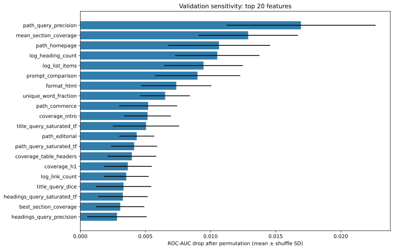
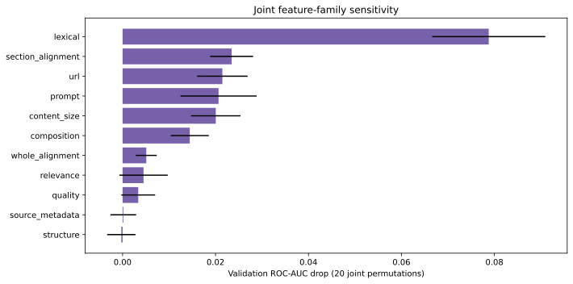
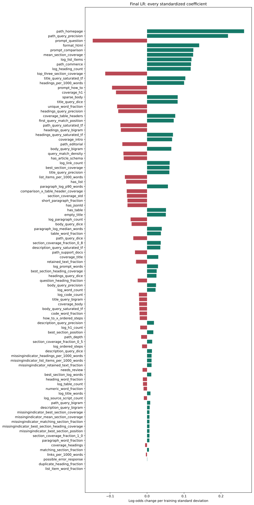
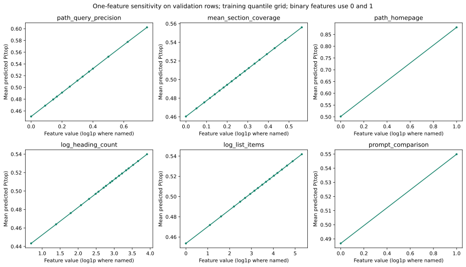
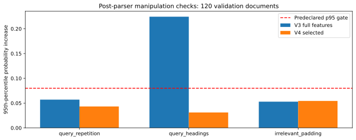

# LR ROC-AUC frontier: v4

Selected **all**, 86 raw features, C=0.01; exact v2 population and hostname assignments.

## Results

| Metric | Frozen v2 | V4 |
|---|---:|---:|
| roc_auc | 0.67689 | 0.67904 |
| log_loss | 0.64148 | 0.64055 |
| brier_score | 0.22561 | 0.22520 |
| accuracy_at_0_5 | 0.62091 | 0.63569 |
| mean_within_host_auc | 0.68586 | 0.69654 |

Reused benchmark: 947 rows / 97 hosts. V4 ROC-AUC 95% host-bootstrap interval [0.6398, 0.7167]. Paired AUC difference +0.00215, 95% interval [-0.01517, +0.01775] (1,000 host bootstrap replicates).

Test is a reused historical benchmark. The interval quantifies host sampling uncertainty, not repeated-development selection bias. Do not claim independent confirmation or causal citation uplift.

## Selection and provenance

Two bounded rounds evaluated 50 configurations total. Four training-host-grouped folds chose C per variant; validation ROC-AUC selected among guardrail-passing finalists. Selected grouped CV AUC: 0.66157; validation AUC: 0.67206. Training-only medians, missing indicators, scaling and LR; no train-plus-validation refit. Model selection was frozen before this test evaluation.

Raw snapshots were not re-prepared. V4 derives a scoring view from cached retention documents: repeated headings and headings without at least five following content words before the next heading receive no heading credit. This can suppress legitimate parent headings; heading-only documents retain body text. Original parser documents remain intact.

Verification reproduced the full training fit, checked hashes and exact row/split identity, and matched raw-input inference on six train/validation snapshots. Cached-feature parity passed for 120 validation documents. No hostname identity, label, source-row position, or split enters a feature.

## Importance and sensitivity guardrails

Absolute standardized coefficient shares: top one **5.8%**, top five **19.9%** (gates 20%/60%). Top positive validation permutation share: **10.5%** (gate 45%). Correlation can spread importance among related features: family permutation is shown too. A balanced plot does not prove absence of leakage. URL path matching is the largest individual permutation signal; lexical matching is the largest joint family. Homepage sensitivity is large for the rare binary switch, so these scores must not be used as an unchecked content-editing reward.

All transformed coefficients, including missing-value indicators:

Response curves vary one feature while holding others fixed; implausible combinations and correlated features limit interpretation. These are not editing recommendations.

## Manipulation checks

The three predeclared checks append repeated query text, twenty duplicate query headings, or unrelated padding to 120 hash-selected validation documents. Each must have mean probability increase ≤0.03 and p95 ≤0.08. These are post-parser checks, not comprehensive raw-HTML adversarial robustness.

| Edit | Mean increase | p95 increase | Maximum increase |
|---|---:|---:|---:|
| query_repetition | -0.0020 | +0.0432 | +0.0745 |
| query_headings | +0.0128 | +0.0312 | +0.0820 |
| irrelevant_padding | +0.0199 | +0.0544 | +0.0910 |

## ELI5 feature descriptions

All body, heading, section, and composition features now use the v4 scoring view described above. URL and source metadata use original page inputs. Log1p squeezes large counts. Missing measurements are imputed from training data.

| Feature | Plain-language description |
|---|---|
| log_prompt_words | How long is the question, with very long questions squeezed down? “Shoes” is shorter than “Which running shoes work best for long-distance training?” |
| prompt_question | Does the wording look like a question? Starts with an English question word or contains ? or ？. It is a simple clue, not a language-understanding test. |
| prompt_comparison | Does the question sound like someone is choosing or comparing things? Looks for words such as “best”, “compare”, “versus”, or “cheapest”. |
| prompt_how_to | Is the person asking how to do something? Looks for the English phrase “how to”. |
| path_depth | How many pieces are in the address after the website name? /guides/shoes/running has depth 3. It is not the number of clicks needed to reach the page. |
| path_homepage | Does the address point to the website’s front door? The path is empty or just /. |
| path_editorial | Does the address look like a blog, guide, or article section? Paths containing /blog/, /guides/, or similar fixed patterns are clues, not verified page types. |
| path_commerce | Does the address look like a shopping or pricing page? Looks for fixed patterns such as /products/, /shop/, or /pricing/. |
| path_support_docs | Does the address look like help or documentation? Looks for fixed patterns such as /help/, /docs/, or /faq/. |
| coverage_title | Does the browser-tab title contain the words you asked about? For “running shoes”, a title containing “shoes” but not “running” gets 1 of 2 words: 0.5. |
| coverage_headings | How many question words appear across all retained headings? Uses structured heading blocks. |
| coverage_body | How many of the question's meaningful word tokens appear anywhere in the retained document? Surrounding text can contribute. |
| coverage_intro | How many question words appear in the first 200 retained tokens? A site header can come before the article. |
| log_word_count | How much text did the retention parser keep across the document? Large counts are squeezed with log1p. This includes retained surrounding content, not only a main article. |
| log_title_words | How long is the browser-tab title? Counts words in the HTML title, which can differ from the big title shown on the page. |
| log_heading_count | How many retained heading blocks are there? Large counts are squeezed with log1p. |
| log_h1_count | How many retained heading blocks are top-level H1 headings? Counts are squeezed with log1p. |
| log_list_items | How many retained list-item blocks are there, including nested items? Container and child text are not counted twice. |
| log_table_count | How many structured table blocks were retained? Counts tables, not rows or cells. |
| log_paragraph_count | How many paragraph blocks did the parser keep? This includes prose inside list items; it is not just the number of original P tags. |
| log_code_count | How many preformatted code blocks were retained? Inline code is not counted separately. |
| log_ordered_steps | How many items directly belong to numbered lists? Nested unordered bullets do not count as numbered steps. |
| headings_per_1000_words | How many retained headings are there per 1,000 retained word tokens? Missing when there are no tokens. |
| list_items_per_1000_words | How many retained list items are there per 1,000 retained word tokens? Missing when there are no tokens. |
| has_table | Is at least one structured table retained? |
| has_list | Is at least one structured list retained? |
| has_jsonld | Is there a machine-readable description attached to the page? Detects JSON-LD scripts; presence does not mean the description is correct. |
| has_article_schema | Does that machine-readable description call the content an article-like item? Recognizes the extractor’s Article-family labels, including NewsArticle and BlogPosting. It does not verify the claims. |
| log_source_script_count | How many script tags did the new parser inventory find in the original HTML? Counts are squeezed; scripts never become article text. |
| empty_title | Is the browser-tab title missing or blank? A missing title is a clue about the snapshot, not proof of low-quality content. |
| retained_text_fraction | How much source text remains in the scoring view after unsupported or repeated headings lose credit? This can still move when source padding changes. |
| needs_review | Did the retention policy flag this selected document for review? A warning stays visible even when its content can be scored. |
| possible_error_response | Did the new source inventory spot error-like wording? It can also match an article discussing errors, so it is a clue rather than proof. |
| sparse_body | Does the retained document have at most 30 word tokens? |
| format_html | Did the new format classifier identify HTML? Markdown and plain text use their native parser. |
| coverage_h1 | How many question words appear in the retained top-level headings? |
| coverage_table_headers | How many question words appear in table header cells? Only cells marked as headers count. |
| best_section_coverage | Which heading-delimited section matches the most question words, and what fraction does it match? |
| mean_section_coverage | On average, how much of the question does each retained section mention? |
| matching_section_fraction | What fraction of retained sections mention at least one meaningful question word? |
| best_section_heading_coverage | Does the heading of the best-matching section itself mention the question? Ties choose the first section. |
| best_section_position | How far down the list of sections is the best match? Zero means first, one means last. If all sections score zero, the first section wins the tie. |
| comparison_x_table_header_coverage | For comparison-style questions, do table headers mention the question words? Zero for other question styles. |
| how_to_x_ordered_steps | For 'how to' questions, how many numbered steps are available? Uses the squeezed step count; zero for other questions. |
| body_query_precision | How much of the distinct body vocabulary belongs to the question? |
| body_query_dice | How similar are the question and body word sets, accounting for both lengths? |
| body_query_saturated_tf | How often do question words appear in body, with diminishing credit for repeats? |
| body_query_bigram | What fraction of adjacent question-word pairs appear together in body? |
| title_query_precision | How much of the distinct title vocabulary belongs to the question? |
| title_query_dice | How similar are the question and title word sets, accounting for both lengths? |
| title_query_saturated_tf | How often do question words appear in title, with diminishing credit for repeats? |
| title_query_bigram | What fraction of adjacent question-word pairs appear together in title? |
| description_query_precision | How much of the distinct description vocabulary belongs to the question? |
| description_query_dice | How similar are the question and description word sets, accounting for both lengths? |
| description_query_saturated_tf | How often do question words appear in description, with diminishing credit for repeats? |
| description_query_bigram | What fraction of adjacent question-word pairs appear together in description? |
| path_query_precision | How much of the distinct path vocabulary belongs to the question? |
| path_query_dice | How similar are the question and path word sets, accounting for both lengths? |
| path_query_saturated_tf | How often do question words appear in path, with diminishing credit for repeats? |
| path_query_bigram | What fraction of adjacent question-word pairs appear together in path? |
| headings_query_precision | How much of the distinct headings vocabulary belongs to the question? |
| headings_query_dice | How similar are the question and headings word sets, accounting for both lengths? |
| headings_query_saturated_tf | How often do question words appear in headings, with diminishing credit for repeats? |
| headings_query_bigram | What fraction of adjacent question-word pairs appear together in headings? |
| section_coverage_fraction_0_5 | What fraction of sections cover at least 50% of question words? |
| section_coverage_fraction_0_8 | What fraction of sections cover at least 80% of question words? |
| section_coverage_fraction_1_0 | What fraction of sections cover at least 100% of question words? |
| section_coverage_std | Is question coverage spread evenly across sections or concentrated in a few? |
| top_three_section_coverage | How well do the three best sections cover the question? |
| best_section_log_words | How long is the section that best matches the question? |
| first_query_match_position | How far into the page is the first question word? |
| query_match_density | What fraction of page words match the question? |
| paragraph_log_median_words | How long is a typical paragraph? |
| paragraph_log_p90_words | How long are the longer paragraphs? |
| short_paragraph_fraction | How many paragraphs are short, readable chunks of 10 to 60 words? |
| unique_word_fraction | How much vocabulary variety does the page have? This also depends on length. |
| numeric_word_fraction | How often does the page include numbers? |
| question_heading_fraction | How many headings are written as questions? |
| duplicate_heading_fraction | How often are headings repeated? |
| log_link_count | How many links appear in retained blocks? |
| links_per_1000_words | How link-heavy is the page relative to its length? |
| heading_word_fraction | How much retained text is inside heading blocks? |
| paragraph_word_fraction | How much retained text is inside paragraph blocks? |
| list_item_word_fraction | How much retained text is inside list item blocks? |
| table_word_fraction | How much retained text is inside table blocks? |
| code_word_fraction | How much retained text is inside code blocks? |

## Promising next features and experiments

- Answer-bearing sentence coverage and evidence density: reward concise relevant explanations, not repeated headings.
- Table question-to-column and row alignment: distinguish useful comparisons from the mere presence of tables.
- Distinct supported facts, units, and procedure completeness; validate extracted values against source blocks.
- Training-fold-only lexical weighting and multilingual matching, with explicit vocabulary provenance.
- Broader raw-HTML manipulation tests and new independent hosts before another benchmark claim.

Avoid rewarding unverifiable authority badges, self-declared freshness, or keyword stuffing. Keep future feature decisions away from the now-inspected test results.

## Reproduction

See `trad_ml_scorer/README.md`. Frozen data/models are ignored under `data/trad_ml_scorer/v4/`; metrics, audit, verification and this report are inspectable artifacts. The existing v2 inference default is preserved; pass the v4 model explicitly.
