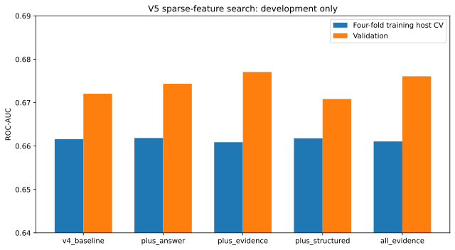
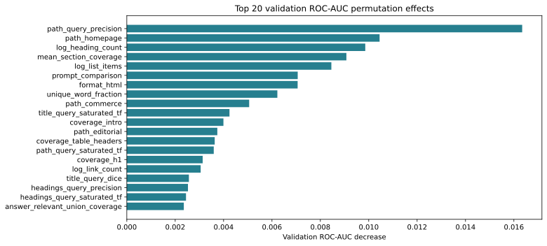
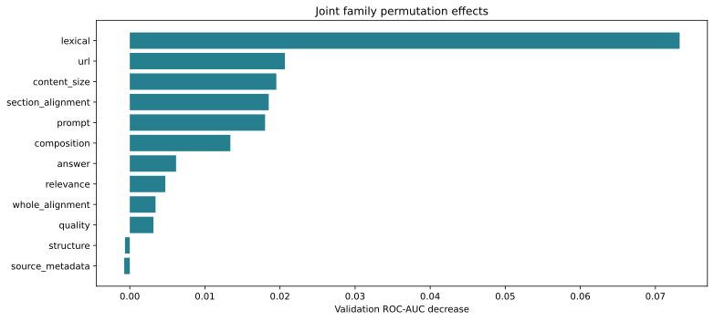
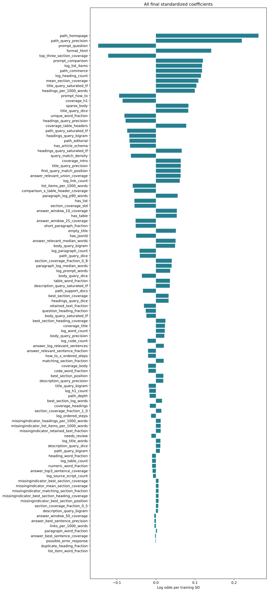
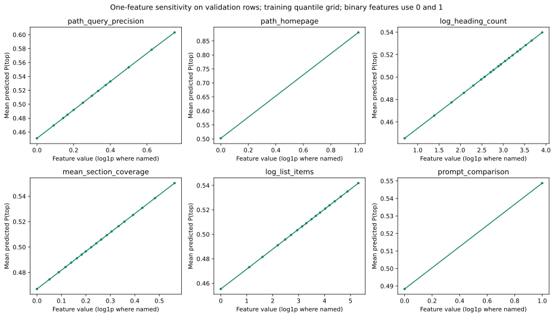
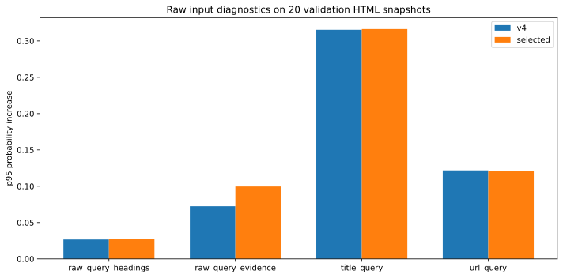

# V5: sparse answer and evidence features

Decision: **plus_answer**, C=0.01, 96 features. New candidate promoted by development rule: **True**.

## Development comparison

| Variant | Grouped training CV AUC | Validation AUC | Gates |
|---|---:|---:|---|
| v4_baseline | 0.66157 | 0.67206 | pass |
| plus_answer | 0.66185 | 0.67435 | pass |
| plus_evidence | 0.66088 | 0.67706 | cv_non_regression |
| plus_structured | 0.66179 | 0.67085 | pass |
| all_evidence | 0.66106 | 0.67607 | cv_non_regression |

Five variants × five C values; fixed four-fold training-host CV chooses C, then validation AUC selects among candidates passing predeclared CV-nonregression and concentration/manipulation rules. Train-only median imputation, missing indicators and scaling. The same reused validation set has guided previous iterations; tiny gains are not independent evidence.

## Frozen reused-benchmark evaluation

| Metric | V4 | V5 |
|---|---:|---:|
| roc_auc | 0.67904 | 0.68088 |
| log_loss | 0.64055 | 0.63896 |
| brier_score | 0.22520 | 0.22453 |
| accuracy_at_0_5 | 0.63569 | 0.62408 |
| mean_within_host_auc | 0.69654 | 0.69260 |

947 rows / 97 hosts, same fixed test population. Paired AUC difference +0.00185, 95% host-bootstrap interval [-0.00253, +0.00604]. Selection froze before evaluation; no tuning followed test inspection. This is a reused historical benchmark, not independent confirmation.

## Importance and sensitivity

Top coefficient share 5.6%; top-five share 18.9%; top positive permutation share 11.4%. Gates: 20%, 60%, 45%. Correlated features can dilute individual importance; examine joint family effects too. Balanced importance does not prove no leakage.

Response curves vary one input at a time and can create implausible combinations. They describe model sensitivity, not causal citation uplift.

## Manipulation checks

The original three post-parser checks use 120 hash-selected validation documents and retain mean-increase ≤.03 / p95 ≤.08 gates. The raw-input extension is a diagnostic on 20 hash-selected validation HTML snapshots: duplicate query headings, a synthetic numeric assertion, title replacement, and query-shaped URL path. It is not exhaustive and did not choose the winner.

| Raw edit | V4 mean increase | V5 mean increase | V5 p95 increase |
|---|---:|---:|---:|
| raw_query_headings | +0.0121 | +0.0125 | +0.0272 |
| raw_query_evidence | +0.0444 | +0.0529 | +0.0997 |
| title_query | +0.2289 | +0.2300 | +0.3163 |
| url_query | +0.0680 | +0.0661 | +0.1206 |

The original gates passed, but this broader diagnostic exposes substantial title/URL sensitivity and score inflation from unverified assertions. Title replacement raises scores by roughly 23 percentage points in both models. The candidate remains experimental and must not serve as an unchecked editing reward.

## New feature glossary (including rejected families)

Query matching uses the existing fixed English stopword list. Sentence candidates contain 6–80 tokens; exact duplicates count once. These cues do not establish factual accuracy. English definition/unit expressions and simple sentence splitting have multilingual and punctuation limitations. Table rows stay separate from headers; ordered-step text follows parser parent links.

| Feature | Family | ELI5 |
|---|---|---|
| answer_best_sentence_coverage | answer | How much of the question appears together in one 6–80-word sentence? |
| answer_top3_sentence_coverage | answer | How much question coverage do the three best distinct sentences provide? |
| answer_relevant_sentence_fraction | answer | What fraction of distinct sentences cover at least half the meaningful question words? |
| answer_log_relevant_sentences | answer | How many distinct question-relevant sentences are available? Large counts are squeezed. |
| answer_best_sentence_precision | answer | How focused is the most question-dense sentence? |
| answer_relevant_median_words | answer | How long is a typical relevant sentence? |
| answer_window_10_coverage | answer | How much of the question occurs within a 10-word prose window? |
| answer_window_25_coverage | answer | How much of the question occurs within a 25-word prose window? |
| answer_window_50_coverage | answer | How much of the question occurs within a 50-word prose window? |
| answer_relevant_union_coverage | answer | Together, how much of the question do relevant distinct sentences cover? |
| evidence_number_fraction | evidence | What fraction of relevant sentences contain a number cue? This does not verify truth. |
| evidence_number_coverage | evidence | How well does the best relevant sentence with a number cue cover the question? |
| evidence_unit_fraction | evidence | What fraction of relevant sentences contain a unit cue? This does not verify truth. |
| evidence_unit_coverage | evidence | How well does the best relevant sentence with a unit cue cover the question? |
| evidence_definition_fraction | evidence | What fraction of relevant sentences contain a definition cue? This does not verify truth. |
| evidence_definition_coverage | evidence | How well does the best relevant sentence with a definition cue cover the question? |
| evidence_linked_fraction | evidence | How often are relevant sentences inside a block with a link? A link need not be a trustworthy citation. |
| evidence_numeric_intent_alignment | evidence | For a numeric question, does a relevant sentence contain a number? |
| evidence_definition_intent_alignment | evidence | For a definition or explanation question, does relevant prose use an explanation cue? |
| table_best_value_row_coverage | structured | How well does one table data row cover the question, excluding header cells? |
| table_top3_value_row_coverage | structured | How well do the three best distinct table data rows match? |
| table_relevant_row_fraction | structured | What fraction of distinct table data rows cover half the question? |
| table_numeric_row_coverage | structured | How well does a table data row containing numbers match the question? |
| table_header_best_coverage | structured | What is the best question match within the headers of one table? |
| table_numeric_intent_alignment | structured | For numeric questions, how relevant is the best numeric table row? |
| steps_best_coverage | structured | How well does one distinct numbered step match the question? |
| steps_relevant_fraction | structured | What fraction of distinct numbered steps cover half the question? |
| steps_howto_alignment | structured | For how-to questions, is there a matching numbered step? |

### Retained baseline features

These 86 features use the unchanged v4 scoring view. Unsupported or repeated headings do not receive heading credit; source metadata and URL inputs stay original.

| Feature | ELI5 |
|---|---|
| log_prompt_words | How long is the question, with very long questions squeezed down? “Shoes” is shorter than “Which running shoes work best for long-distance training?” |
| prompt_question | Does the wording look like a question? Starts with an English question word or contains ? or ？. It is a simple clue, not a language-understanding test. |
| prompt_comparison | Does the question sound like someone is choosing or comparing things? Looks for words such as “best”, “compare”, “versus”, or “cheapest”. |
| prompt_how_to | Is the person asking how to do something? Looks for the English phrase “how to”. |
| path_depth | How many pieces are in the address after the website name? /guides/shoes/running has depth 3. It is not the number of clicks needed to reach the page. |
| path_homepage | Does the address point to the website’s front door? The path is empty or just /. |
| path_editorial | Does the address look like a blog, guide, or article section? Paths containing /blog/, /guides/, or similar fixed patterns are clues, not verified page types. |
| path_commerce | Does the address look like a shopping or pricing page? Looks for fixed patterns such as /products/, /shop/, or /pricing/. |
| path_support_docs | Does the address look like help or documentation? Looks for fixed patterns such as /help/, /docs/, or /faq/. |
| coverage_title | Does the browser-tab title contain the words you asked about? For “running shoes”, a title containing “shoes” but not “running” gets 1 of 2 words: 0.5. |
| coverage_headings | How many question words appear across all retained headings? Uses structured heading blocks. |
| coverage_body | How many of the question's meaningful word tokens appear anywhere in the retained document? Surrounding text can contribute. |
| coverage_intro | How many question words appear in the first 200 retained tokens? A site header can come before the article. |
| log_word_count | How much text did the retention parser keep across the document? Large counts are squeezed with log1p. This includes retained surrounding content, not only a main article. |
| log_title_words | How long is the browser-tab title? Counts words in the HTML title, which can differ from the big title shown on the page. |
| log_heading_count | How many retained heading blocks are there? Large counts are squeezed with log1p. |
| log_h1_count | How many retained heading blocks are top-level H1 headings? Counts are squeezed with log1p. |
| log_list_items | How many retained list-item blocks are there, including nested items? Container and child text are not counted twice. |
| log_table_count | How many structured table blocks were retained? Counts tables, not rows or cells. |
| log_paragraph_count | How many paragraph blocks did the parser keep? This includes prose inside list items; it is not just the number of original P tags. |
| log_code_count | How many preformatted code blocks were retained? Inline code is not counted separately. |
| log_ordered_steps | How many items directly belong to numbered lists? Nested unordered bullets do not count as numbered steps. |
| headings_per_1000_words | How many retained headings are there per 1,000 retained word tokens? Missing when there are no tokens. |
| list_items_per_1000_words | How many retained list items are there per 1,000 retained word tokens? Missing when there are no tokens. |
| has_table | Is at least one structured table retained? |
| has_list | Is at least one structured list retained? |
| has_jsonld | Is there a machine-readable description attached to the page? Detects JSON-LD scripts; presence does not mean the description is correct. |
| has_article_schema | Does that machine-readable description call the content an article-like item? Recognizes the extractor’s Article-family labels, including NewsArticle and BlogPosting. It does not verify the claims. |
| log_source_script_count | How many script tags did the new parser inventory find in the original HTML? Counts are squeezed; scripts never become article text. |
| empty_title | Is the browser-tab title missing or blank? A missing title is a clue about the snapshot, not proof of low-quality content. |
| retained_text_fraction | What share of the parser's original source-text tokens survived into the retained text? Capped at one. This replaces v1's main-content focus and removal fractions. |
| needs_review | Did the retention policy flag this selected document for review? A warning stays visible even when its content can be scored. |
| possible_error_response | Did the new source inventory spot error-like wording? It can also match an article discussing errors, so it is a clue rather than proof. |
| sparse_body | Does the retained document have at most 30 word tokens? |
| format_html | Did the new format classifier identify HTML? Markdown and plain text use their native parser. |
| coverage_h1 | How many question words appear in the retained top-level headings? |
| coverage_table_headers | How many question words appear in table header cells? Only cells marked as headers count. |
| best_section_coverage | Which heading-delimited section matches the most question words, and what fraction does it match? |
| mean_section_coverage | On average, how much of the question does each retained section mention? |
| matching_section_fraction | What fraction of retained sections mention at least one meaningful question word? |
| best_section_heading_coverage | Does the heading of the best-matching section itself mention the question? Ties choose the first section. |
| best_section_position | How far down the list of sections is the best match? Zero means first, one means last. If all sections score zero, the first section wins the tie. |
| comparison_x_table_header_coverage | For comparison-style questions, do table headers mention the question words? Zero for other question styles. |
| how_to_x_ordered_steps | For 'how to' questions, how many numbered steps are available? Uses the squeezed step count; zero for other questions. |
| body_query_precision | How much of the distinct body vocabulary belongs to the question? |
| body_query_dice | How similar are the question and body word sets, accounting for both lengths? |
| body_query_saturated_tf | How often do question words appear in body, with diminishing credit for repeats? |
| body_query_bigram | What fraction of adjacent question-word pairs appear together in body? |
| title_query_precision | How much of the distinct title vocabulary belongs to the question? |
| title_query_dice | How similar are the question and title word sets, accounting for both lengths? |
| title_query_saturated_tf | How often do question words appear in title, with diminishing credit for repeats? |
| title_query_bigram | What fraction of adjacent question-word pairs appear together in title? |
| description_query_precision | How much of the distinct description vocabulary belongs to the question? |
| description_query_dice | How similar are the question and description word sets, accounting for both lengths? |
| description_query_saturated_tf | How often do question words appear in description, with diminishing credit for repeats? |
| description_query_bigram | What fraction of adjacent question-word pairs appear together in description? |
| path_query_precision | How much of the distinct path vocabulary belongs to the question? |
| path_query_dice | How similar are the question and path word sets, accounting for both lengths? |
| path_query_saturated_tf | How often do question words appear in path, with diminishing credit for repeats? |
| path_query_bigram | What fraction of adjacent question-word pairs appear together in path? |
| headings_query_precision | How much of the distinct headings vocabulary belongs to the question? |
| headings_query_dice | How similar are the question and headings word sets, accounting for both lengths? |
| headings_query_saturated_tf | How often do question words appear in headings, with diminishing credit for repeats? |
| headings_query_bigram | What fraction of adjacent question-word pairs appear together in headings? |
| section_coverage_fraction_0_5 | What fraction of sections cover at least 50% of question words? |
| section_coverage_fraction_0_8 | What fraction of sections cover at least 80% of question words? |
| section_coverage_fraction_1_0 | What fraction of sections cover at least 100% of question words? |
| section_coverage_std | Is question coverage spread evenly across sections or concentrated in a few? |
| top_three_section_coverage | How well do the three best sections cover the question? |
| best_section_log_words | How long is the section that best matches the question? |
| first_query_match_position | How far into the page is the first question word? |
| query_match_density | What fraction of page words match the question? |
| paragraph_log_median_words | How long is a typical paragraph? |
| paragraph_log_p90_words | How long are the longer paragraphs? |
| short_paragraph_fraction | How many paragraphs are short, readable chunks of 10 to 60 words? |
| unique_word_fraction | How much vocabulary variety does the page have? This also depends on length. |
| numeric_word_fraction | How often does the page include numbers? |
| question_heading_fraction | How many headings are written as questions? |
| duplicate_heading_fraction | How often are headings repeated? |
| log_link_count | How many links appear in retained blocks? |
| links_per_1000_words | How link-heavy is the page relative to its length? |
| heading_word_fraction | How much retained text is inside heading blocks? |
| paragraph_word_fraction | How much retained text is inside paragraph blocks? |
| list_item_word_fraction | How much retained text is inside list item blocks? |
| table_word_fraction | How much retained text is inside table blocks? |
| code_word_fraction | How much retained text is inside code blocks? |

The full coefficient chart includes all baseline and selected new features.

## Provenance and reproduction

Source parsing and population filtering were not rerun. Snapshot archive hashes, original feature hashes and extractor versions are recorded; v4 columns, IDs, labels, splits and quality membership are unchanged. Full train-only refit parity and zero hostname overlap passed at selection. The raw stress run verified raw/cached feature parity on all 20 original pages. Models and matrices remain ignored caches.

See [plan.md](plan.md) for the predeclared search and embedding integration contract. This round implements no embeddings or projection methods.

## Next round and embedding handoff

- Join page-field vectors by exact snapshot ID and field/extraction version; query vectors need prompt hash or record ID. Never join only by URL.
- Obtain model/revision, dimensions, pooling, truncation, missing-field indicators and benchmark populations. Fit learned projections/normalization inside each training fold, then on training only.
- Combine per-field semantic similarity with answer-sentence coverage and factual/table evidence cues. Keep field-level ablations and concentration checks.
- Treat numerical assertions and links as unverified cues. Validate source-supported evidence and broaden metadata/raw-HTML stress tests before using scores as an optimization reward.
- Collect fresh hosts for independent confirmation; do not optimize the next round from this reused test reading.
