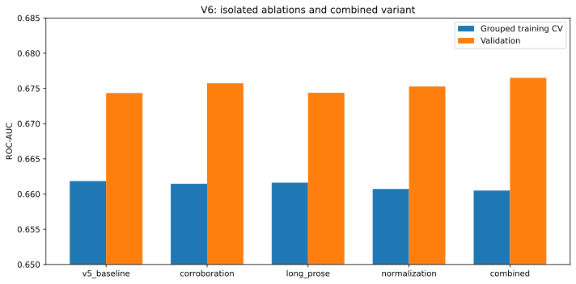
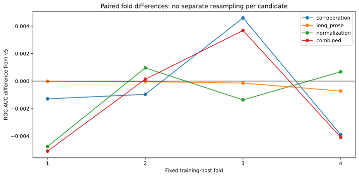
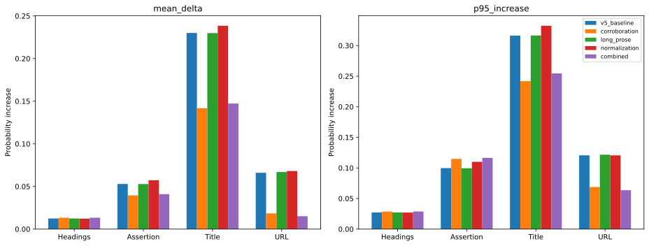
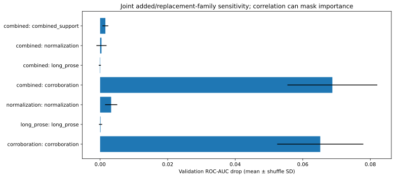
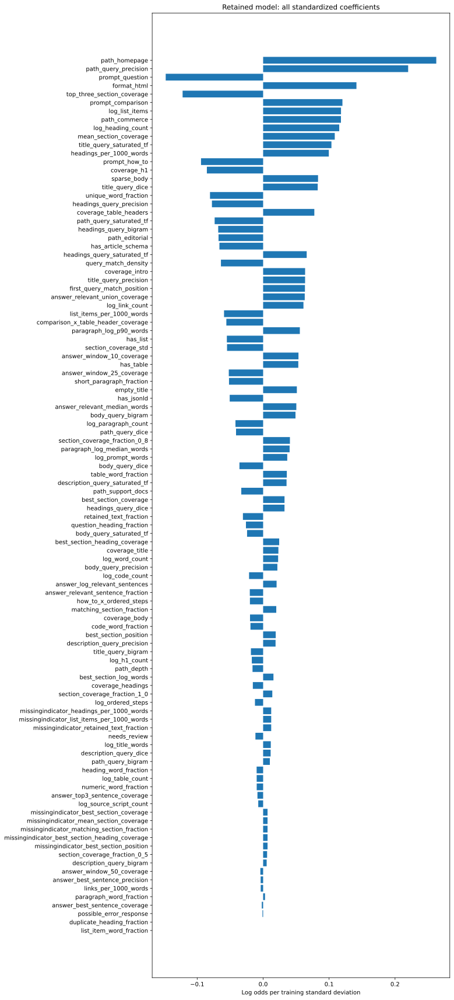
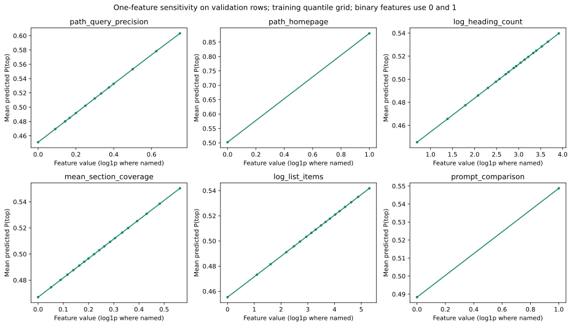

# V6 controlled experiments

Decision: **v5_baseline**. New candidate promoted: **False**.

## Results

| Variant | CV AUC | CV delta | Validation AUC | Validation delta | Failed gates |
|---|---:|---:|---:|---:|---|
| v5_baseline | 0.66185 | +0.00000 | 0.67435 | +0.00000 | none |
| corroboration | 0.66146 | -0.00039 | 0.67573 | +0.00138 | stress, cv_non_regression, raw_non_regression |
| long_prose | 0.66162 | -0.00023 | 0.67439 | +0.00004 | cv_non_regression |
| normalization | 0.66072 | -0.00112 | 0.67528 | +0.00092 | cv_non_regression, raw_non_regression |
| combined | 0.66051 | -0.00134 | 0.67651 | +0.00215 | stress, cv_non_regression, raw_non_regression |

Five variants × five regularization values; identical four training-host folds (seed 137), training-only transforms and fitting. C is selected per variant using CV ROC-AUC. The strict CV non-regression gate was declared before outcomes. Small negative CV deltas do not establish statistical harm; they do mean these candidates did not meet this experiment’s promotion rule.

## What each intervention changes

- **Corroboration:** replaces nine original title/URL match inputs with products using best answer-sentence coverage. Other source/path-type inputs remain. Body support is lexical, not factual verification.
- **Long prose:** adds 10/25/50-token coverage windows for deduplicated prose segments longer than 80 tokens. Windows stay inside segments. The v5 sentence features are unchanged.
- **Normalization:** adds separate normalized title/path/body/prose coverage, gain and numeric matching. Fixed English plurals, narrow hyphen aliases, number formatting and unit aliases; no learned vocabulary or unit-magnitude conversion. Normalized prose windows retain v5’s 6–80-token eligibility to isolate this change.
- **Combined:** applies all changes; normalized title/path inputs are also multiplied by body support so they do not bypass corroboration.

## Robustness and importance

Original gates: top-one absolute coefficient share ≤20%, top-five ≤60%, top positive feature-permutation share ≤45%; three post-parser edits on 120 validation documents require mean inflation ≤.03 and p95 ≤.08. New raw-edit gate: all four edits must have mean and p95 inflation no more than .01 above v5 on the same 20 validation HTML snapshots. The relative gate tolerates existing v5 weaknesses and is not an absolute safety guarantee.

| Variant | Top coefficient share | Top-five share | Top positive permutation share | Title mean inflation | URL mean inflation |
|---|---:|---:|---:|---:|---:|
| v5_baseline | 5.6% | 18.9% | 11.4% | +0.2300 | +0.0661 |
| corroboration | 5.0% | 17.8% | 11.3% | +0.1418 | +0.0185 |
| long_prose | 5.4% | 18.3% | 11.1% | +0.2299 | +0.0669 |
| normalization | 5.4% | 18.3% | 12.8% | +0.2385 | +0.0681 |
| combined | 4.7% | 16.7% | 11.9% | +0.1473 | +0.0152 |

### Original post-parser stress results

| Variant | Edit | Mean increase | p95 increase |
|---|---|---:|---:|
| v5_baseline | query_repetition | -0.0006 | +0.0657 |
| v5_baseline | query_headings | +0.0131 | +0.0318 |
| v5_baseline | irrelevant_padding | +0.0194 | +0.0541 |
| corroboration | query_repetition | +0.0039 | +0.1120 |
| corroboration | query_headings | +0.0141 | +0.0353 |
| corroboration | irrelevant_padding | +0.0180 | +0.0509 |
| long_prose | query_repetition | -0.0188 | +0.0664 |
| long_prose | query_headings | +0.0131 | +0.0318 |
| long_prose | irrelevant_padding | +0.0195 | +0.0542 |
| normalization | query_repetition | +0.0019 | +0.0701 |
| normalization | query_headings | +0.0130 | +0.0321 |
| normalization | irrelevant_padding | +0.0189 | +0.0533 |
| combined | query_repetition | -0.0111 | +0.1308 |
| combined | query_headings | +0.0141 | +0.0354 |
| combined | irrelevant_padding | +0.0179 | +0.0517 |

Corroboration reduces direct title/URL editing sensitivity, but repeated query prose can fabricate its required support: p95 inflation is about .112, versus .066 for v5. Combined reaches .131. This is why metadata improvement alone does not justify promotion.

Correlated inputs can spread apparent importance. Family permutations and single-feature response curves can create implausible combinations; neither establishes causal editing benefit. Lexical corroboration cannot prove truth or prevent synthetic supporting prose.

## Test and deployment decision

**No new test evaluation.** All new candidates failed the predeclared development rule; retain v5. The historical v5 test AUC remains 0.68088 on 947 rows / 97 hosts and was not used to choose v6 features. No defaults or frozen v1–v5 artifacts changed.

## ELI5: tested feature definitions

| Feature | Family | Explanation |
|---|---|---|
| supported_coverage_title | corroboration | coverage_title multiplied by best answer-sentence coverage: metadata gets lexical credit only when prose also matches. |
| supported_title_query_precision | corroboration | title_query_precision multiplied by best answer-sentence coverage: metadata gets lexical credit only when prose also matches. |
| supported_title_query_dice | corroboration | title_query_dice multiplied by best answer-sentence coverage: metadata gets lexical credit only when prose also matches. |
| supported_title_query_saturated_tf | corroboration | title_query_saturated_tf multiplied by best answer-sentence coverage: metadata gets lexical credit only when prose also matches. |
| supported_title_query_bigram | corroboration | title_query_bigram multiplied by best answer-sentence coverage: metadata gets lexical credit only when prose also matches. |
| supported_path_query_precision | corroboration | path_query_precision multiplied by best answer-sentence coverage: metadata gets lexical credit only when prose also matches. |
| supported_path_query_dice | corroboration | path_query_dice multiplied by best answer-sentence coverage: metadata gets lexical credit only when prose also matches. |
| supported_path_query_saturated_tf | corroboration | path_query_saturated_tf multiplied by best answer-sentence coverage: metadata gets lexical credit only when prose also matches. |
| supported_path_query_bigram | corroboration | path_query_bigram multiplied by best answer-sentence coverage: metadata gets lexical credit only when prose also matches. |
| long_window_10_best | long_prose | Best question coverage inside a 10-word window in prose segments longer than 80 tokens. |
| long_window_10_mean | long_prose | Average best 10-word question coverage across distinct long prose segments; exact repetition receives no extra count. |
| long_window_25_best | long_prose | Best question coverage inside a 25-word window in prose segments longer than 80 tokens. |
| long_window_25_mean | long_prose | Average best 25-word question coverage across distinct long prose segments; exact repetition receives no extra count. |
| long_window_50_best | long_prose | Best question coverage inside a 50-word window in prose segments longer than 80 tokens. |
| long_window_50_mean | long_prose | Average best 50-word question coverage across distinct long prose segments; exact repetition receives no extra count. |
| normalized_title_coverage | normalization | Question-word coverage in title after fixed plural, spelling, unit and number normalization. |
| normalized_title_gain | normalization | Change in title coverage from lexical normalization; may be negative when normalization changes token sets. |
| normalized_path_coverage | normalization | Question-word coverage in path after fixed plural, spelling, unit and number normalization. |
| normalized_path_gain | normalization | Change in path coverage from lexical normalization; may be negative when normalization changes token sets. |
| normalized_body_coverage | normalization | Question-word coverage in body after fixed plural, spelling, unit and number normalization. |
| normalized_body_gain | normalization | Change in body coverage from lexical normalization; may be negative when normalization changes token sets. |
| normalized_prose_window_10 | normalization | Best 10-word prose coverage after normalization, using the same 6–80-token sentence eligibility as v5. |
| normalized_prose_window_25 | normalization | Best 25-word prose coverage after normalization, using the same 6–80-token sentence eligibility as v5. |
| normalized_number_coverage | normalization | Do the explicit numbers in the question appear in the body after numeric-format normalization? Units are not converted. |
| supported_normalized_title_coverage | combined_support | normalized_title_coverage multiplied by prose support, keeping combined metadata corroboration intact. |
| supported_normalized_title_gain | combined_support | normalized_title_gain multiplied by prose support, keeping combined metadata corroboration intact. |
| supported_normalized_path_coverage | combined_support | normalized_path_coverage multiplied by prose support, keeping combined metadata corroboration intact. |
| supported_normalized_path_gain | combined_support | normalized_path_gain multiplied by prose support, keeping combined metadata corroboration intact. |

## Retained baseline feature glossary

| Feature | Explanation |
|---|---|
| log_prompt_words | How long is the question, with very long questions squeezed down? “Shoes” is shorter than “Which running shoes work best for long-distance training?” |
| prompt_question | Does the wording look like a question? Starts with an English question word or contains ? or ？. It is a simple clue, not a language-understanding test. |
| prompt_comparison | Does the question sound like someone is choosing or comparing things? Looks for words such as “best”, “compare”, “versus”, or “cheapest”. |
| prompt_how_to | Is the person asking how to do something? Looks for the English phrase “how to”. |
| path_depth | How many pieces are in the address after the website name? /guides/shoes/running has depth 3. It is not the number of clicks needed to reach the page. |
| path_homepage | Does the address point to the website’s front door? The path is empty or just /. |
| path_editorial | Does the address look like a blog, guide, or article section? Paths containing /blog/, /guides/, or similar fixed patterns are clues, not verified page types. |
| path_commerce | Does the address look like a shopping or pricing page? Looks for fixed patterns such as /products/, /shop/, or /pricing/. |
| path_support_docs | Does the address look like help or documentation? Looks for fixed patterns such as /help/, /docs/, or /faq/. |
| coverage_title | Does the browser-tab title contain the words you asked about? For “running shoes”, a title containing “shoes” but not “running” gets 1 of 2 words: 0.5. |
| coverage_headings | How many question words appear across all retained headings? Uses structured heading blocks. |
| coverage_body | How many of the question's meaningful word tokens appear anywhere in the retained document? Surrounding text can contribute. |
| coverage_intro | How many question words appear in the first 200 retained tokens? A site header can come before the article. |
| log_word_count | How much text did the retention parser keep across the document? Large counts are squeezed with log1p. This includes retained surrounding content, not only a main article. |
| log_title_words | How long is the browser-tab title? Counts words in the HTML title, which can differ from the big title shown on the page. |
| log_heading_count | How many retained heading blocks are there? Large counts are squeezed with log1p. |
| log_h1_count | How many retained heading blocks are top-level H1 headings? Counts are squeezed with log1p. |
| log_list_items | How many retained list-item blocks are there, including nested items? Container and child text are not counted twice. |
| log_table_count | How many structured table blocks were retained? Counts tables, not rows or cells. |
| log_paragraph_count | How many paragraph blocks did the parser keep? This includes prose inside list items; it is not just the number of original P tags. |
| log_code_count | How many preformatted code blocks were retained? Inline code is not counted separately. |
| log_ordered_steps | How many items directly belong to numbered lists? Nested unordered bullets do not count as numbered steps. |
| headings_per_1000_words | How many retained headings are there per 1,000 retained word tokens? Missing when there are no tokens. |
| list_items_per_1000_words | How many retained list items are there per 1,000 retained word tokens? Missing when there are no tokens. |
| has_table | Is at least one structured table retained? |
| has_list | Is at least one structured list retained? |
| has_jsonld | Is there a machine-readable description attached to the page? Detects JSON-LD scripts; presence does not mean the description is correct. |
| has_article_schema | Does that machine-readable description call the content an article-like item? Recognizes the extractor’s Article-family labels, including NewsArticle and BlogPosting. It does not verify the claims. |
| log_source_script_count | How many script tags did the new parser inventory find in the original HTML? Counts are squeezed; scripts never become article text. |
| empty_title | Is the browser-tab title missing or blank? A missing title is a clue about the snapshot, not proof of low-quality content. |
| retained_text_fraction | What share of the parser's original source-text tokens survived into the retained text? Capped at one. This replaces v1's main-content focus and removal fractions. |
| needs_review | Did the retention policy flag this selected document for review? A warning stays visible even when its content can be scored. |
| possible_error_response | Did the new source inventory spot error-like wording? It can also match an article discussing errors, so it is a clue rather than proof. |
| sparse_body | Does the retained document have at most 30 word tokens? |
| format_html | Did the new format classifier identify HTML? Markdown and plain text use their native parser. |
| coverage_h1 | How many question words appear in the retained top-level headings? |
| coverage_table_headers | How many question words appear in table header cells? Only cells marked as headers count. |
| best_section_coverage | Which heading-delimited section matches the most question words, and what fraction does it match? |
| mean_section_coverage | On average, how much of the question does each retained section mention? |
| matching_section_fraction | What fraction of retained sections mention at least one meaningful question word? |
| best_section_heading_coverage | Does the heading of the best-matching section itself mention the question? Ties choose the first section. |
| best_section_position | How far down the list of sections is the best match? Zero means first, one means last. If all sections score zero, the first section wins the tie. |
| comparison_x_table_header_coverage | For comparison-style questions, do table headers mention the question words? Zero for other question styles. |
| how_to_x_ordered_steps | For 'how to' questions, how many numbered steps are available? Uses the squeezed step count; zero for other questions. |
| body_query_precision | How much of the distinct body vocabulary belongs to the question? |
| body_query_dice | How similar are the question and body word sets, accounting for both lengths? |
| body_query_saturated_tf | How often do question words appear in body, with diminishing credit for repeats? |
| body_query_bigram | What fraction of adjacent question-word pairs appear together in body? |
| title_query_precision | How much of the distinct title vocabulary belongs to the question? |
| title_query_dice | How similar are the question and title word sets, accounting for both lengths? |
| title_query_saturated_tf | How often do question words appear in title, with diminishing credit for repeats? |
| title_query_bigram | What fraction of adjacent question-word pairs appear together in title? |
| description_query_precision | How much of the distinct description vocabulary belongs to the question? |
| description_query_dice | How similar are the question and description word sets, accounting for both lengths? |
| description_query_saturated_tf | How often do question words appear in description, with diminishing credit for repeats? |
| description_query_bigram | What fraction of adjacent question-word pairs appear together in description? |
| path_query_precision | How much of the distinct path vocabulary belongs to the question? |
| path_query_dice | How similar are the question and path word sets, accounting for both lengths? |
| path_query_saturated_tf | How often do question words appear in path, with diminishing credit for repeats? |
| path_query_bigram | What fraction of adjacent question-word pairs appear together in path? |
| headings_query_precision | How much of the distinct headings vocabulary belongs to the question? |
| headings_query_dice | How similar are the question and headings word sets, accounting for both lengths? |
| headings_query_saturated_tf | How often do question words appear in headings, with diminishing credit for repeats? |
| headings_query_bigram | What fraction of adjacent question-word pairs appear together in headings? |
| section_coverage_fraction_0_5 | What fraction of sections cover at least 50% of question words? |
| section_coverage_fraction_0_8 | What fraction of sections cover at least 80% of question words? |
| section_coverage_fraction_1_0 | What fraction of sections cover at least 100% of question words? |
| section_coverage_std | Is question coverage spread evenly across sections or concentrated in a few? |
| top_three_section_coverage | How well do the three best sections cover the question? |
| best_section_log_words | How long is the section that best matches the question? |
| first_query_match_position | How far into the page is the first question word? |
| query_match_density | What fraction of page words match the question? |
| paragraph_log_median_words | How long is a typical paragraph? |
| paragraph_log_p90_words | How long are the longer paragraphs? |
| short_paragraph_fraction | How many paragraphs are short, readable chunks of 10 to 60 words? |
| unique_word_fraction | How much vocabulary variety does the page have? This also depends on length. |
| numeric_word_fraction | How often does the page include numbers? |
| question_heading_fraction | How many headings are written as questions? |
| duplicate_heading_fraction | How often are headings repeated? |
| log_link_count | How many links appear in retained blocks? |
| links_per_1000_words | How link-heavy is the page relative to its length? |
| heading_word_fraction | How much retained text is inside heading blocks? |
| paragraph_word_fraction | How much retained text is inside paragraph blocks? |
| list_item_word_fraction | How much retained text is inside list item blocks? |
| table_word_fraction | How much retained text is inside table blocks? |
| code_word_fraction | How much retained text is inside code blocks? |
| answer_best_sentence_coverage | How much of the question appears together in one 6–80-word sentence? |
| answer_top3_sentence_coverage | How much question coverage do the three best distinct sentences provide? |
| answer_relevant_sentence_fraction | What fraction of distinct sentences cover at least half the meaningful question words? |
| answer_log_relevant_sentences | How many distinct question-relevant sentences are available? Large counts are squeezed. |
| answer_best_sentence_precision | How focused is the most question-dense sentence? |
| answer_relevant_median_words | How long is a typical relevant sentence? |
| answer_window_10_coverage | How much of the question occurs within a 10-word prose window? |
| answer_window_25_coverage | How much of the question occurs within a 25-word prose window? |
| answer_window_50_coverage | How much of the question occurs within a 50-word prose window? |
| answer_relevant_union_coverage | Together, how much of the question do relevant distinct sentences cover? |

## Provenance and reproduction

All v5 record IDs, labels, hostname splits and the selected 96 feature columns are preserved. Cached document hashes and code fingerprints are verified. Raw audit checks feature parity on every original sampled page. Finalization verifies full training-only refit parity and zero hostname overlap. No corpus parsing or embedding generation was repeated.

See [plan.md](plan.md) and the package README for predeclared rules and reproduction commands. Runtime models and matrices remain ignored and shared locally. Results from the earlier v5 round are preserved separately.

## Follow-up

- Retain v5 while awaiting the other session’s per-field embedding results. Apply the snapshot/field/prompt identity and fold-local projection-fitting contract already documented in v5.
- Consider corroboration as a robustness research direction only if it measurably reduces editing sensitivity; simple lexical support can itself be fabricated.
- Expand normalization only with language-aware evidence and targeted failure examples. The current narrow English rules are heuristic, not a general morphological analyzer.
- Use new independent hosts for confirmation. Do not relax these gates after seeing results or reopen the reused test to rescue a rejected variant.
