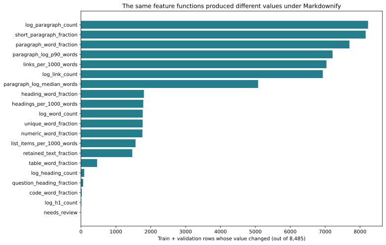

# V7.1: retrained with consistent Markdownify inputs

**Completed:** all 45 context features now come from the same saved Markdownify corpus as the ten semantic similarities. The original v7 is preserved. The new model is `lr-semantic-v7.1`.

The old model learned page structure from an earlier parser, while the webapp uses Markdownify. Paragraph boundaries and other measurements can change even when the feature functions have the same names. This refit fixes that training-input mismatch. It does not tune a new model family.

## What changed

Rebuilt 45 context columns on all **9,432** existing eligible rows, with **zero new exclusions**. The ten semantic columns are identical to the saved v7 cache. All 55 feature names/order, labels, hostname splits, C=.001, missing-value handling and scaling policy are unchanged. **20 context columns** changed somewhere in train/validation.



## Evaluation

| Configuration | Validation AUC | Within-host AUC | Log loss | Brier | Accuracy |
|---|---:|---:|---:|---:|---:|
| Original v7 / legacy context | 0.66443 | 0.68474 | 0.65195 | 0.23004 | 0.62328 |
| Old model / Markdownify context | 0.66495 | 0.68546 | 0.65161 | 0.22990 | 0.62011 |
| Retrained / Markdownify context | 0.66501 | 0.68536 | 0.65177 | 0.22997 | 0.62434 |

Corrected four-fold training-host CV AUC: **0.67398** (original v7: .67440). Validation: 945 rows / 97 hosts. Retrained-versus-original validation AUC difference: **+0.00058**, paired 95% website-bootstrap interval **[-0.00117, +0.00231]**, 1,000 samples. The difference is small and uncertain. The reason to adopt this artifact is consistent preprocessing, not demonstrated accuracy uplift.

The middle row isolates passing Markdownify inputs to the old model, mirroring the reported mismatch. It is diagnostic, not a candidate selected for deployment. Validation is reused development evidence. No test predictions/metrics, new feature selection, regularization search, embedding calls or Platt scaling were performed.

## Provenance and parity

- Verified corpus manifest and records/documents indexes against v7 embedding provenance; each loaded compressed document is SHA-checked and its content identity/chunk partition validated.
- Joined by original source-file hash and row; checked prompt, URL, hostname, snapshot, payload, label, split and embedding extraction identity. Never joined by URL alone.
- All imputation/scaling/LR fits use training hosts only; zero hostname overlap between partitions.
- On **20 fixed validation HTML snapshots**, freshly parsed context features and probabilities match those from saved documents within 1e-12. Actual maximum feature delta: 0; probability delta: 0.
- All checked parser files match the corpus fingerprints. The parity check reuses existing semantic scores; it does not rerun the embedding pipeline or execute the webapp.
- Model save/reload produces identical validation predictions. Training recipe, feature hashes, document provenance and runtime dependencies are recorded alongside the artifact.

## Webapp handoff

Use the new artifact and shared assembly function together. The legacy v7 model should not receive these recomputed context features.

**Model:** `/Users/ext-weihsiang.lin/Documents/profound/data/content-optimization-system/trad_ml_scorer/v7.1/model.joblib`

**Model SHA256:** `d1c4b25480a1579239b8fd9c8bfa7d3beac11bfa2ec591d8540941b6f89493cc`

```python
from trad_ml_scorer.predict_markdownify import load_model, predict_document

model = load_model("/Users/ext-weihsiang.lin/Documents/profound/data/content-optimization-system/trad_ml_scorer/v7.1/model.joblib")
# document: current Markdownify structured document with source inventory.
# similarities: all ten named original-space cosines for this prompt/document.
score = predict_document(model, prompt, document, similarities)
```

The loader rejects the original mixed-parser model, wrong feature order and changed feature-code fingerprints. The assembly function requires Markdownify provenance and the original source word count; it never substitutes old context columns or treats missing cosine as zero.

**Remaining webapp work:** The webapp is not in this checkout and was not modified or deployed. Wire this model/adapter into it. Its embedding producer must use the same 3,072D OpenAI model, `blocks-v3-markdownify` serializer, chunking, normalization and pooling recipe as the saved run. For proposed edits, rebuild derived text/outline/chunks and invalidate/recompute embeddings for the changed document revision. This adapter cannot detect a caller supplying stale semantic scores. Arbitrary rewritten-document parity and cache invalidation remain part of issue #15.

## Reuse / reproduce

All prepared features, per-row resumable checkpoints, joined IDs, manifest and fitted model persist under `/Users/ext-weihsiang.lin/Documents/profound/data/content-optimization-system/trad_ml_scorer/v7.1`. Original v7 and corpus files were not modified.

```sh
uv run python -m trad_ml_scorer.retrain_markdownify --workers 2
# After interrupted preparation, rerun with the identical recipe.
# If feature preparation finished but training did not:
uv run python -m trad_ml_scorer.retrain_markdownify --reuse-features
uv run python -m trad_ml_scorer.verify_markdownify_refit
uv run python -m trad_ml_scorer.build_markdownify_refit_report
```

Completed features/results refuse overwrite. No corpus extraction or embedding regeneration is needed. Report artifacts are under `trad_ml_scorer/v7.1/`; full caches and model weights remain outside Git.
