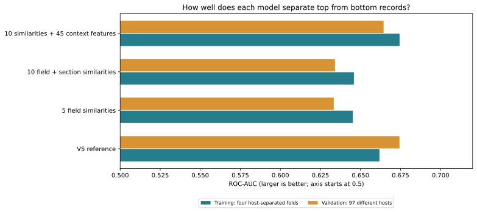
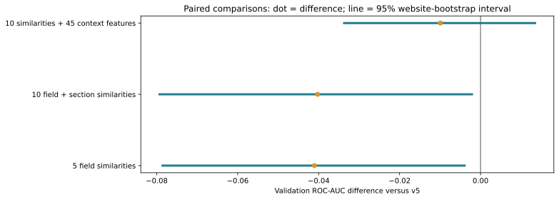

# Embedding-similarity prototype: v7

**Purpose:** Replace literal question-word matching with vector-based question–page similarities. This report measures predictive performance. Page-edit interpretation and recommendations are on hold.

An embedding turns text into a list of numbers. We compare the direction of two lists (cosine similarity): one for the question, another for a page field. This can recognize related wording without requiring identical words. It does not verify factual accuracy or whether a page truly answers the question.

**Development result:** The CV-selected prototype is **10 similarities + 45 context features**. Its training CV ROC-AUC is **0.6744**, while validation ROC-AUC is **0.6644**. V5 validation is **0.6744**. This is not evidence of a validated replacement. The default scorer remains unchanged; the test benchmark was not evaluated.

## What we compared

| Variant | What goes into the model |
|---|---|
| V5 reference | Existing 96 handcrafted measurements. Its fixed C=.01 refit reproduces frozen validation predictions exactly. |
| 5 field similarities | Question compared with title, best H1, outline, whole page and URL path. No term-overlap features. |
| 10 field + section similarities | The five field matches plus five summaries of question-to-section-chunk similarity. |
| 10 similarities + 45 context features | The ten matches plus existing prompt-only/document-only measurements, such as page structure and metadata. No lexical prompt–document matching. |

All versions use logistic regression. The three semantic variants each try five regularization settings (C=.001/.01/.1/1/10). C and the preferred semantic variant are chosen only by average ROC-AUC over four training folds, with entire websites kept together. Missing-value handling and scaling are fitted separately inside every fold, then on training rows for each final prototype.

## Results on the same records

ROC-AUC measures how often a randomly chosen top record scores above a randomly chosen bottom record. Within-host AUC averages that calculation separately across websites. These are high/low label predictions, not estimates of absolute citation probability.



| Variant | Features | C | CV AUC | Validation AUC | Within-host AUC | Log loss ↓ | Brier ↓ | Average precision | Accuracy |
|---|---:|---:|---:|---:|---:|---:|---:|---:|---:|
| V5 reference | 96 | 0.01 | 0.6618 | 0.6744 | 0.6896 | 0.6450 | 0.2270 | 0.6644 | 0.6233 |
| 5 field similarities | 5 | 0.001 | 0.6452 | 0.6333 | 0.6440 | 0.6660 | 0.2368 | 0.6281 | 0.6032 |
| 10 field + section similarities | 10 | 0.01 | 0.6459 | 0.6341 | 0.6534 | 0.6645 | 0.2362 | 0.6254 | 0.5979 |
| 10 similarities + 45 context features | 55 | 0.001 | 0.6744 | 0.6644 | 0.6847 | 0.6519 | 0.2300 | 0.6500 | 0.6233 |

Log loss and Brier measure prediction error; lower is better. Accuracy uses a 0.5 threshold. Feature counts exclude automatically added missingness flags. Full confusion matrices, folds and candidate scores are in results.json.



The selected prototype differs from v5 by **-0.0099 validation AUC**, with a paired 95% website-bootstrap interval **[-0.0337, +0.0135]**. We resample the same websites for both models, 1,000 times. The interval describes this development comparison; it does not include training or model-selection uncertainty. Validation has already been reused in previous iterations, so this is not independent confirmation.

## Where the features came from

- Corpus: `processed/markdownify-corpus-v1-complete/`.
- Representation run: `representations/runs/markdownify-openai-v1/`.
- Encoder: supplied OpenAI `text-embedding-3-large`, 3,072 dimensions; serializer `blocks-v3-markdownify`.
- Page and outline embeddings can be content-weighted pooled vectors from chunks. H1 similarity takes the best available H1. Section statistics are over chunks, not necessarily one score per unique section.
- Source artifacts and matching corpus records/documents were SHA256-verified. No API calls, live-page fetching or embedding regeneration were needed.

**Why not use the supplied 32D coordinates?** Query, title, page and other fields have separately fitted PCA axes. Comparing their coordinates directly would compare different coordinate systems. Those fits also use the whole training partition, which includes the held-out fold during training CV. We use original-space similarities, which require no dataset-fitted projection. A projected comparison would need one shared basis applied to both sides, fitted afresh inside each training fold.

**Comparison limitation:** The new semantic signals come from Markdownify, while v5 uses the retention parser. Thus this comparison changes representation and parsing together. The context variant mixes Markdownify semantic features with the frozen retention-based context. It does not isolate an embedding-only causal effect or establish the incremental benefit over a context-only model.

## Identity, coverage and leakage checks

Records join on original source-file hash + source row, then require matching snapshot, payload hash, exact prompt, URL, hostname, label and split. We never join by URL alone. Existing eligible records and host assignments are unchanged; host overlap is zero. Preparation checks test metadata/coverage, but no test predictions or test metrics were computed.

| Split | Eligible rows | Hosts | Page and section similarities available |
|---|---:|---:|---:|
| train | 7540 | 771 | 7540 |
| validation | 945 | 97 | 945 |
| test | 947 | 97 | 947 |

All 9,432 existing eligible rows match; no new exclusions. The common page-and-section-available validation subset is therefore the full 945 rows. Some optional fields are absent; absence remains NaN until training-fitted imputation, rather than being silently replaced with a zero similarity.

| Feature | Train missing | Validation missing | Test missing (metadata only) |
|---|---:|---:|---:|
| title_similarity | 106 | 15 | 13 |
| h1_similarity | 461 | 64 | 29 |
| outline_similarity | 83 | 9 | 2 |
| page_similarity | 0 | 0 | 0 |
| path_similarity | 116 | 11 | 15 |
| section_max | 0 | 0 | 0 |
| section_top3_mean | 0 | 0 | 0 |
| section_median | 0 | 0 | 0 |
| section_q25 | 0 | 0 | 0 |
| section_q75 | 0 | 0 | 0 |

On 20 deterministically selected validation records, we independently recomputed **200 similarities** from the original vectors. Maximum absolute disagreement with the supplied alignment was **1.2e-07**. This is a bounded numerical/provenance check, not an exhaustive semantic-quality assessment.

## Each semantic feature in plain language

All ten similarities depend on both the prompt and the document. Their values use cosine in the same original embedding space. A higher value means a closer embedding match, not necessarily a better citation outcome.

| Feature | Meaning |
|---|---|
| `title_similarity` | How closely the question and page title match in embedding space. |
| `h1_similarity` | The closest matching main heading (H1); maximum when there are several. |
| `outline_similarity` | How closely the question matches the heading outline. |
| `page_similarity` | How closely the question matches the whole-page representation; long pages use pooled chunks. |
| `path_similarity` | How closely the question matches the normalized URL path. |
| `section_max` | The closest matching section chunk anywhere in the page. |
| `section_top3_mean` | Average match of the three closest section chunks (or all if fewer). |
| `section_median` | The middle section-chunk match: how relevant a typical chunk is. |
| `section_q25` | The lower-quarter section-chunk match. |
| `section_q75` | The upper-quarter section-chunk match. |

## Reuse and reproduce

Saved prototype models and prepared features are under the ignored `data/trad_ml_scorer/v7/` directory. Reuse them to avoid data preparation. Model bundles require the named precomputed features in the saved order; this is an offline prototype, not a live HTML-to-score endpoint. Raw embeddings and fitted weights are not checked into Git.

```sh
uv run python -m trad_ml_scorer.prepare_semantic --run /path/to/markdownify-openai-v1 --corpus /path/to/markdownify-corpus-v1-complete
uv run python -m trad_ml_scorer.semantic_experiment
uv run python -m trad_ml_scorer.build_semantic_report
uv run python -m pytest -q
```

Preparation and training refuse to overwrite frozen outputs. Rebuild only the report when caches/results already exist. `results.json` stores source hashes, the complete search and fold assignments; `validation_predictions.json` enables paired checks. `plan.md` records the comparison fixed before fitting.

## Scope of this prototype

No further tuning based on these validation readings, no test reopening, no automatic promotion, and no page-edit recommendations in this round. A later round could separate context-only effects, compare encodings under the same parser, or test a shared fold-fitted projection. Any additional comparison should be planned before it is run.
