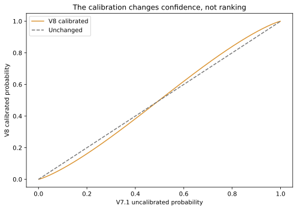
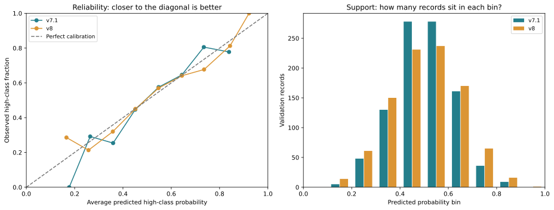

# V8: Platt calibration on v7.1

**Question:** When the scorer says “70% high-class probability,” do roughly 70% of comparable sampled records have the high label? V7.1 supplies probabilities, but its sigmoid alone does not guarantee this. V8 adds a small probability correction without changing the base ranking model.

**Decision: Retain v7.1 default; v8 calibration remains experimental.** Point estimates improve, but the uncertainty around the change is too wide to pass the predeclared promotion rule. V8 is saved for inspection; nothing was deployed or silently enabled.

## What we fitted

`v8 probability = sigmoid(1.191472 × v7.1 logit + 0.006419)`

The input is the LR decision-function score before its sigmoid, not the existing probability. We fit two numbers: a slope and an offset. Here the slope is above one, so the correction generally moves probabilities farther from the middle. It leaves the page ranking unchanged.



| V7.1 score | V8 score |
|---:|---:|
| 10% | 6.84% |
| 30% | 26.83% |
| 50% | 50.16% |
| 70% | 73.42% |
| 90% | 93.24% |

## Fitting without using validation labels

We split the 7,540 training records (771 hosts) into the existing four hostname-grouped folds. Each fold fits its own imputer, scaler and C=.001 LR on the other hosts. Every training record receives exactly one score from a model that did not train on its host. The two calibration parameters are then fitted on those out-of-fold scores and training labels only.

The fit uses Platt class-count target smoothing, uniform row weights and no regularization. Positive targets are `(Npos+1)/(Npos+2)` and negative targets `1/(Nneg+2)`; counts use only training data. We minimize mean cross-entropy using stable logaddexp/expit, an analytic gradient, and L-BFGS-B. The fit must converge with a positive slope. This is one recipe, with no calibration-method or parameter search.

The final base is the exact saved v7.1 model, unchanged. Its weights were fitted on all training hosts, whereas the calibration scores came from smaller fold fits. Validation measures how well the calibration transfers to that final model. Historical feature/C selection and validation exploration mean this is reused development evidence, not independent confirmation.

## Same validation records, before and after

| Metric | V7.1 | V8 |
|---|---:|---:|
| ROC-AUC ↑ | 0.665009 | 0.665009 |
| Within-host ROC-AUC ↑ | 0.685355 | 0.685355 |
| Log loss ↓ | 0.651768 | 0.650824 |
| Brier score ↓ | 0.229970 | 0.229506 |
| ECE ↓ | 0.030040 | 0.021884 |
| Average precision ↑ | 0.650080 | 0.650080 |
| Accuracy at 0.5 | 0.624339 | 0.623280 |

945 validation records / 97 hosts, identical coverage before and after. No new exclusions. Positive slope preserves ordering; observed AUC and within-host AUC are identical. No new numerical ties, rank inversions or exact 0/1 saturation occurred. A fixed 0.5 threshold can still change classifications when the calibration offset moves the decision boundary.

### How certain is the change?

Differences below are V8 minus V7.1; negative is better. Each bootstrap draw resamples the same website clusters for both predictions (1,000 draws). These intervals do not include model-fitting or historical selection uncertainty.

| Metric difference | Estimate | Paired 95% interval |
|---|---:|---|
| log_loss | -0.000944 | [-0.003784, +0.002049] |
| brier_score | -0.000464 | [-0.001674, +0.000748] |
| ece | -0.008156 | [-0.024176, +0.013260] |

The predeclared rule requires positive slope, preserved ranking, no saturation/new ties, improvements in both log loss and Brier, and a log-loss interval entirely below zero. Only the last condition fails. We retain v7.1 as the default rather than treating a small favorable point estimate as a confirmed improvement.

## Reliability: what to look for

In the left chart, each point groups records with similar predicted probabilities. For example, predictions averaging 60% should have about 60% high labels. The dashed line marks perfect agreement. The right chart shows how much data supports those points. Sparse bins can move a lot with only a few records; empty bins have no reliability point. Connecting lines are visual guides, not fitted curves.



ECE is the count-weighted average absolute gap between predicted probability and observed positive fraction. We use ten fixed equal-width bins: [0,.1), [.1,.2), …, [.9,1]. ECE depends on binning, so it is descriptive and not the sole acceptance criterion. A lower ECE here does not prove the model is calibrated across all hosts or probabilities.

| Bin | V7.1 count | V7.1 predicted / observed | V8 count | V8 predicted / observed |
|---|---:|---|---:|---|
| 0.0–0.1 | 0 | — | 0 | — |
| 0.1–0.2 | 5 | 0.178 / 0.000 | 14 | 0.166 / 0.286 |
| 0.2–0.3 | 48 | 0.264 / 0.292 | 61 | 0.257 / 0.213 |
| 0.3–0.4 | 130 | 0.359 / 0.254 | 150 | 0.358 / 0.320 |
| 0.4–0.5 | 278 | 0.451 / 0.446 | 231 | 0.452 / 0.450 |
| 0.5–0.6 | 278 | 0.548 / 0.576 | 237 | 0.547 / 0.570 |
| 0.6–0.7 | 161 | 0.644 / 0.646 | 170 | 0.644 / 0.641 |
| 0.7–0.8 | 36 | 0.735 / 0.806 | 65 | 0.736 / 0.677 |
| 0.8–0.9 | 9 | 0.839 / 0.778 | 16 | 0.843 / 0.812 |
| 0.9–1.0 | 0 | — | 1 | 0.922 / 1.000 |

## API and artifacts

Calibration artifact: `/Users/ext-weihsiang.lin/Documents/profound/data/content-optimization-system/trad_ml_scorer/v8/calibration.joblib`

SHA256: `f525979690fdc2772be2c7759c954148cff66f538233ebedb2a449699de38269`

Bound base model: `/Users/ext-weihsiang.lin/Documents/profound/data/content-optimization-system/trad_ml_scorer/v7.1/model.joblib`

Base SHA256: `d1c4b25480a1579239b8fd9c8bfa7d3beac11bfa2ec591d8540941b6f89493cc`

```python
from trad_ml_scorer.predict_platt import load_calibrated_model, predict_calibrated_document
model = load_calibrated_model("/Users/ext-weihsiang.lin/Documents/profound/data/content-optimization-system/trad_ml_scorer/v8/calibration.joblib")
result = predict_calibrated_document(model, prompt, document, semantic_scores)
# result exposes raw_logit, uncalibrated_high_class_probability,
# calibrated_high_class_probability, model_version and base_model_version.
```

The loader checks the exact base checksum, feature order, version and implementation fingerprints. Saved/reloaded calibrated predictions match exactly. This is a separate opt-in adapter: existing v7.1 consumers do not change. Document/semantic-score freshness obligations from v7.1 still apply. Webapp integration was not performed.

OOF logits, labels, record IDs and fold assignments live alongside the calibration artifact in shared `trad_ml_scorer/v8/training_oof.npz`. Results record fit/scored hosts for every fold, input/model/code hashes and optimizer details. Raw data and fitted artifacts stay outside Git.

## Limits and reproduction

These probabilities concern `is_cited_high` under balanced host-relative top/bottom sampling, not whether an answer engine will cite a page at all. Calibration does not correct an unknown deployment class prior, establish causal edit uplift, or supply reliable per-host calibration from roughly ten sampled records. No test predictions or metrics were computed. Fresh-host confirmation needs a separately planned dataset and evaluation.

```sh
uv run python -m trad_ml_scorer.calibration_experiment
uv run python -m trad_ml_scorer.build_calibration_report
uv run python -m pytest -q
```

The experiment refuses to replace completed artifacts. Reuse the saved calibration and OOF cache; only rebuilding the report is needed for presentation changes. No data preparation, embeddings or changes to v7.1 weights are required.
